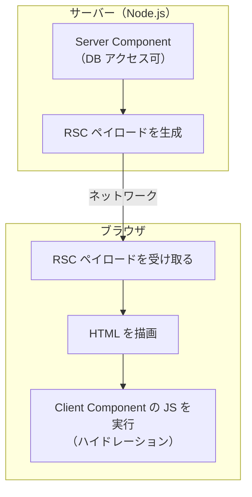
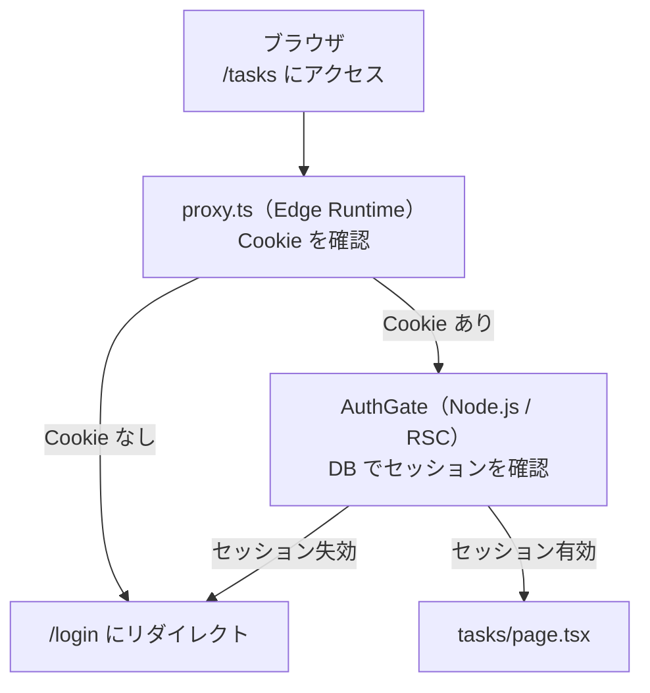

# 第 01 章：プロジェクト基盤の仕組み

## この章の目標

> **CHECK**
> - [ ] `pnpm dev` / `pnpm build` / `pnpm start` の違いを説明できる
> - [ ] Turbopack が何をしているか説明できる
> - [ ] Server Component と Client Component の違いを口頭で説明できる
> - [ ] `proxy.ts` がリクエストのどこで動くか説明できる
> - [ ] 研修リポジトリをクローンし、構成と開発ツール（Biome / Lefthook）を**説明できる**
> - [ ] `pnpm dev` で初期ページが表示できる

---

> [!IMPORTANT]
> **この研修は「クローン型」です。`create-next-app` でゼロから新規作成はしません。**
> 研修リポジトリには `lib/`（DB・認証・Result 型ほか）・shadcn 部品・共通シェルの**出発版**、
> および Biome / Lefthook / Drizzle などの設定が**すべて同梱済み**です。
> この章では、その構成と土台の仕組みを**読んで理解**し、開発サーバーを起動します。
> 完成系コードは別リポジトリ（`answer`）で参照します（README の手順 2 を参照）。

---

## 1-1. `pnpm dev` / `pnpm build` / `pnpm start` の仕組み

「なぜ `pnpm dev` でブラウザにアプリが表示されるのか」を理解しましょう。

### 全体の流れ

```
[あなたが書いたコード]
   ↓ pnpm dev / pnpm build（Next.js が変換・バンドル）
[Node.js サーバーが起動]
   ↓ ブラウザが http://localhost:3000 にアクセス
[サーバーが HTML + JavaScript を返す]
   ↓
[ブラウザが画面を描画]
```

### 3 つのコマンドの違い

| コマンド     | 用途     | 特徴                                                        |
| ------------ | -------- | ----------------------------------------------------------- |
| `pnpm dev`   | 開発中   | 変更すると即座に反映（HMR）。速度優先                        |
| `pnpm build` | 本番準備 | コード全体を最適化・圧縮し `.next/` に出力                   |
| `pnpm start` | 本番稼働 | `pnpm build` の成果物でサーバーを起動（`build` の後に実行） |

**HMR（Hot Module Replacement）** とは、コードを変更したときにページ全体をリロードせず、変更部分だけをブラウザに送り込む仕組みです。

> NOTE
> `pnpm start` は `pnpm build` が終わっていないと動きません。開発中は `pnpm dev` だけで OK です。

---

## 1-2. Turbopack とは何か

**Turbopack** は Vercel（Next.js を作っている会社）が開発した Rust 製の高速バンドラで、webpack の後継です。

| 比較項目 | webpack    | Turbopack |
| -------- | ---------- | --------- |
| 言語     | JavaScript | Rust      |
| 起動速度 | 普通〜遅い | 高速      |

このプロジェクトは **Next.js 16** を使います。Next.js 16 では **`pnpm dev`・`pnpm build` とも Turbopack が既定**で、特別なフラグは不要です。

```bash
pnpm dev
# → 内部で Turbopack が起動する（ターミナルに "Turbopack" の表示が出る）
```

> NOTE
> Turbopack の内部実装は深追い不要です。「webpack より速い Next.js 標準のバンドラ」と覚えておけば十分です。

---

## 1-3. Server Component と Client Component

App Router の最重要概念です。ここを理解しておくと後の章がスムーズになります。

### RSC（React Server Components）

RSC では、コンポーネントを「サーバーで実行するもの」と「ブラウザで実行するもの」に分けられます。

```
Server Component（デフォルト）
  ・サーバーで JSX を完成させる
  ・DB に直接アクセスできる
  ・完成した HTML をブラウザに送る（送る JS が減る）

Client Component（'use client' を書く）
  ・ブラウザで JavaScript が実行される
  ・useState / useEffect が使える
  ・クリックなどのインタラクションを担う
```

### 概念図



### 判断の基準

| やりたいこと                       | 種類              |
| ---------------------------------- | ----------------- |
| DB から直接データを取得したい      | Server Component  |
| `async / await` で取得したい       | Server Component  |
| `useState` / `useEffect` を使いたい | Client Component |
| クリックなどを処理したい           | Client Component  |

```tsx
// Server Component（デフォルト・何も書かない）
export default async function TaskList() {
  const tasks = await db.select().from(tasksTable); // DB に直接アクセス
  return <ul>{/* ... */}</ul>;
}
```

```tsx
// Client Component（先頭に 'use client'）
'use client';
import { useState } from "react";

export default function SearchInput() {
  const [query, setQuery] = useState("");
  return <input value={query} onChange={(e) => setQuery(e.target.value)} />;
}
```

> NOTE
> Server Component から Client Component へは props でデータを渡せますが、
> 渡せるのはシリアライズ可能な値（文字列・数値・プレーンオブジェクトなど）だけです。関数やクラスのインスタンスは渡せません。

---

## 1-4. `proxy.ts` のリクエストフロー

このプロジェクトには `proxy.ts` があり、**すべてのリクエストの最前段**で動きます。認証は二段構えです。



> NOTE
> **Edge Runtime** は超高速だが Node.js の全機能は使えない実行環境です。
> `proxy.ts` は Edge で動くため `better-sqlite3`（Native Module）が使えません。
> だから **Cookie の有無だけ**を確認し、DB セッションの検証は Node.js の `AuthGate`（第 06 章）に任せます。
> 以前のバージョンで `middleware.ts` と呼ばれていたものが、Next.js 16 では `proxy.ts` という名前になりました（役割は同じ）。

`proxy.ts` の完成形は `git show answer/main:proxy.ts` で確認できます（実装は第 06 章）。

---

## 1-5. ハンズオン：研修リポジトリを動かす

### Step 1：前提ツールの確認

```bash
node --version    # v24.x 以上
pnpm --version    # 9.x 以上を推奨
```

pnpm が無ければ：

```bash
npm install -g pnpm
```

### Step 2：クローンして作業ブランチを切る

README の「進め方」に従い、研修リポジトリをクローンして作業ブランチを切ります。

```bash
git switch -c training/<自分の名前>
```

回答リポジトリ（完成系）も `answer` リモートとして登録しておきます（初回のみ）。

```bash
git remote add answer https://github.com/GentaAmeku/dashboard-playground-nextjs
git fetch answer
```

### Step 3：依存関係をインストール

```bash
pnpm install
```

### Step 4：構成を読む

このリポジトリにすでに何が入っているかを確認しましょう。**ゼロから作るのではなく、土台を理解する**のがこの章の目的です。

```bash
ls -la
```

| ファイル / ディレクトリ | 役割 |
| --- | --- |
| `app/` | App Router のルート（**ここを各章で実装していく**） |
| `app/(authed)/components/` | 共通シェル（AppSidebar / AppHeader / PageContainer）の出発版 |
| `components/ui/` | shadcn/ui 部品（同梱済み） |
| `lib/` | DB・認証・Result 型・Repository・Service など（同梱済み） |
| `proxy.ts` | 認証ガード（Edge Runtime） |
| `biome.json` | Biome（lint / format）の設定 |
| `.lefthook.yml` | Git フック（commit 時の自動チェック） |
| `next.config.ts` | Next.js の設定（`reactCompiler` / `cacheComponents`） |

### Step 5：開発サーバーを起動

```bash
pnpm dev
```

`http://localhost:3000` にアクセスし、初期ページが表示されれば成功です。

> NOTE
> この時点では `app/` はまだ初期状態です。`/tasks` などの画面は第 03 章以降で作っていきます。

### Step 6：Biome（lint / format）を理解する

ESLint の代わりに **Biome** を使います。lint と format を 1 つのツールで担います（設定は `biome.json` に同梱済み）。

```bash
pnpm lint     # チェックのみ（CI / フックで使用）
pnpm format   # 自動修正（lint + format + import 整列）
```

よくある Biome ルール：

| ルール             | 内容                                      |
| ------------------ | ----------------------------------------- |
| `useImportType`    | 型のみの import は `import type { ... }` にする |
| `noUnusedVariables`| 未使用変数を削除                          |
| `noExplicitAny`    | `any` を具体的な型に                       |

### Step 7：Lefthook（pre-commit フック）を理解する

**Lefthook** はコミット時に自動で `pnpm lint` / `pnpm format` を実行します（`.lefthook.yml` に同梱済み）。初回のみフックを有効化します。

```bash
pnpm lefthook install
```

動作を確認してみましょう。

```bash
# 故意に lint エラーを混ぜてコミットを試す
echo "const unused = 1" >> app/page.tsx
git add app/page.tsx
git commit -m "test"
# → pre-commit フックが走り、lint エラーで拒否される

git checkout app/page.tsx   # 元に戻す
```

> NOTE
> `.lefthook.yml` の `stage_fixed: true` により、Biome の自動修正で変わったファイルが自動で `git add` されます。

---

## 1-6. React Compiler について（補足）

`next.config.ts` に `reactCompiler: true` が設定されています。

**React Compiler** は再レンダリングを自動最適化するコンパイラで、`useMemo` / `useCallback` を手書きしなくても最適化してくれます。

```ts
// next.config.ts（抜粋）
const nextConfig = {
  reactCompiler: true,   // 自動メモ化
  cacheComponents: true, // "use cache" を有効化
};
```

> NOTE
> 詳細は第 12 章で扱います。今は「`useMemo` を書かなくても最適化される」とだけ覚えておけば OK です。

---

## まとめと次のステップ

この章では以下を確認しました：

- `pnpm dev`（Turbopack + HMR）/ `pnpm build` / `pnpm start` の違い
- Server Component（サーバー実行・DB 直アクセス）と Client Component（`'use client'`）の違い
- `proxy.ts`（Edge）と `AuthGate`（Node.js）の二段認証ガード
- 研修リポジトリの構成と、Biome / Lefthook という開発ツール
- `pnpm dev` で初期ページを表示

次の第 02 章では **Tailwind v4 と shadcn/ui** を扱い、UI の基礎を整えます。

→ [第 02 章：Tailwind v4 + shadcn/ui](./02-tailwind-shadcn.md)
