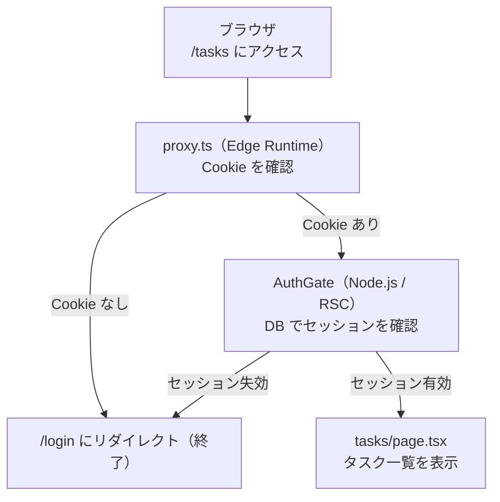
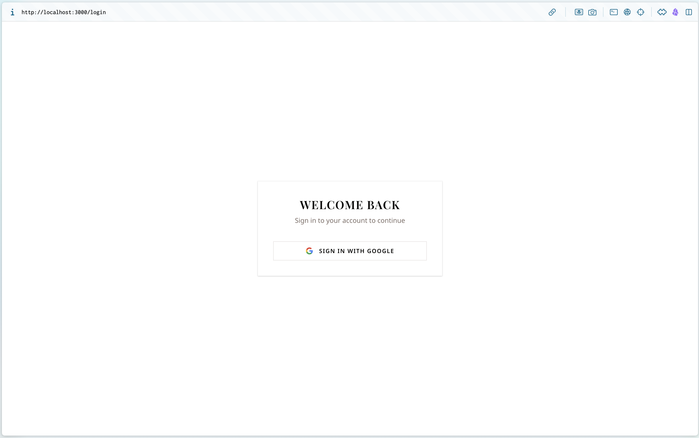

# 第 06 章：Better Auth + Google OAuth

## この章の目標

> **CHECK**
> - [ ] Google Cloud Console で OAuth クライアント ID を発行できる
> - [ ] `lib/auth.ts` と `lib/auth-client.ts` を設定できる
> - [ ] Google ログインで `/login` → `/` に遷移できる
> - [ ] ログアウトで `/login` に戻れる
> - [ ] `proxy.ts` と `AuthGate` の二段ガードが動いている

---

> [!IMPORTANT]
> **【コピー OK】`lib/auth.ts` / `lib/auth-client.ts` / `proxy.ts` はリポジトリに同梱済みです。**
> 本章では設定の意味を読みながらコピーで進めて構いません。
> 中身の詳細（Result 型・Repository・Service）は **第 11–12 章（より深く）** で扱います。
>
> ```bash
> git show answer/main:lib/auth.ts         # Better Auth サーバー設定
> git show answer/main:lib/auth-client.ts  # クライアント向けヘルパー
> git show answer/main:proxy.ts            # Edge ルーター（Cookie チェック）
> ```

---

## 6-1. このプロジェクトの認証フロー

認証は二段構えになっています。



**なぜ二段構えか？**

- `proxy.ts`（Edge）：Cookie の存在だけを確認する。`better-sqlite3`（Native Module）が Edge では使えないため DB アクセスは不可
- `AuthGate`（Node.js）：DB のセッションを確認する。Cookie が残っていても DB のセッションが削除されていればリダイレクト

---

## 6-2. Better Auth の Better なところ

[Better Auth](https://www.better-auth.com) は Typescript ファーストな認証ライブラリです。

| 比較               | NextAuth.js          | Better Auth         |
| ------------------ | -------------------- | ------------------- |
| TypeScript サポート | 後付け               | 最初から型安全       |
| DB スキーマ        | 手動で作成が必要     | Drizzle と自動連携  |
| セッション管理     | Cookie / JWT         | DB ベース（安全）   |
| OAuth プロバイダー | 多数                 | 主要プロバイダー対応 |

---

## 6-3. Google Cloud Console の設定

> NOTE
> この手順には Google アカウントが必要です。まだの場合は作成してください。

### Step 1：プロジェクトを作成する

1. [Google Cloud Console](https://console.cloud.google.com) にアクセス
2. 上部のプロジェクト選択ドロップダウン → 「新しいプロジェクト」
3. プロジェクト名を入力（例: `my-dashboard-dev`）→ 「作成」

### Step 2：OAuth 同意画面を設定する

1. 左メニュー → 「APIs & Services」→「OAuth consent screen」
2. User Type: 「外部」を選択 → 「作成」
3. アプリ情報を入力：
   - アプリ名: `Dashboard Playground`
   - ユーザーサポートメール: 自分のメール
4. 「保存して次へ」を繰り返し最後まで進む

### Step 3：OAuth クライアント ID を作成する

1. 左メニュー → 「APIs & Services」→「認証情報」
2. 「認証情報を作成」→「OAuth クライアント ID」
3. アプリケーションの種類: 「ウェブアプリケーション」
4. 名前: `Dashboard Playground Local`
5. 承認済みのリダイレクト URI に追加:
   ```
   http://localhost:3000/api/auth/callback/google
   ```
6. 「作成」をクリック

表示される **クライアント ID** と **クライアント シークレット** をメモしておきます。

### Step 4：`.env.local` に設定する

```bash
cp .env.example .env.local
```

`.env.local` を編集します：

```bash
# セッション署名用シークレット（ランダムな文字列を生成）
BETTER_AUTH_SECRET=（openssl rand -base64 32 の出力）
BETTER_AUTH_URL=http://localhost:3000
NEXT_PUBLIC_BETTER_AUTH_URL=http://localhost:3000

# Google Cloud Console で取得した値
GOOGLE_CLIENT_ID=（クライアント ID）
GOOGLE_CLIENT_SECRET=（クライアント シークレット）
```

シークレットの生成：

```bash
# ターミナルで実行
openssl rand -base64 32
# → ランダムな文字列が出力される。それを BETTER_AUTH_SECRET に設定
```

> NOTE
> `.env.local` は **絶対にコミットしないでください**。`.gitignore` に含まれていますが、念のため確認します。
> `cat .gitignore | grep env` で `.env.local` が除外されていることを確認しましょう。

---

## 6-4. パッケージのインストール

```bash
pnpm add better-auth better-sqlite3
pnpm add -D @types/better-sqlite3
```

---

## 6-5. Better Auth の設定

### サーバー設定（`lib/auth.ts`）

```bash
touch lib/auth.ts
```

```typescript
// lib/auth.ts
import { betterAuth } from "better-auth";
import { drizzleAdapter } from "better-auth/adapters/drizzle";
import { getDB } from "@/lib/db/client";
import * as schema from "@/lib/db/schema";

export const auth = betterAuth({
  // セッション署名用シークレット
  secret: process.env.BETTER_AUTH_SECRET!,

  // アプリの URL（認証コールバックに使用）
  baseURL: process.env.BETTER_AUTH_URL!,

  // Drizzle ORM と連携してセッションを DB に保存する
  database: drizzleAdapter(getDB(), {
    provider: "sqlite",
    schema: {
      user: schema.user,
      session: schema.session,
      account: schema.account,
      verification: schema.verification,
    },
    camelCase: true,  // DB のスネークケースを JS のキャメルケースに変換
  }),

  // Google OAuth の設定
  socialProviders: {
    google: {
      clientId: process.env.GOOGLE_CLIENT_ID!,
      clientSecret: process.env.GOOGLE_CLIENT_SECRET!,
    },
  },
});
```

### クライアント設定（`lib/auth-client.ts`）

```bash
touch lib/auth-client.ts
```

```typescript
// lib/auth-client.ts
import { createAuthClient } from "better-auth/react";

// Better Auth のクライアントを生成する
export const authClient = createAuthClient({
  baseURL: process.env.NEXT_PUBLIC_BETTER_AUTH_URL!,
});

// よく使う関数をエクスポート
export const { signIn, signOut, useSession } = authClient;
```

---

## 6-6. DB スキーマに認証テーブルを追加する

Better Auth は 4 つのテーブルを使います。`lib/db/schema.ts` に追加します。

```typescript
// lib/db/schema.ts（認証テーブルを追加）

// ... 既存の tasks テーブルの後に追加 ...

// Better Auth が使うテーブル
export const user = sqliteTable("user", {
  id: text("id").primaryKey(),
  name: text("name").notNull(),
  email: text("email").notNull().unique(),
  emailVerified: integer("email_verified", { mode: "boolean" }).notNull().default(false),
  image: text("image"),
  createdAt: integer("created_at", { mode: "timestamp" }).notNull(),
  updatedAt: integer("updated_at", { mode: "timestamp" }).notNull(),
});

export const session = sqliteTable("session", {
  id: text("id").primaryKey(),
  expiresAt: integer("expires_at", { mode: "timestamp" }).notNull(),
  token: text("token").notNull().unique(),
  createdAt: integer("created_at", { mode: "timestamp" }).notNull(),
  updatedAt: integer("updated_at", { mode: "timestamp" }).notNull(),
  ipAddress: text("ip_address"),
  userAgent: text("user_agent"),
  userId: text("user_id")
    .notNull()
    .references(() => user.id, { onDelete: "cascade" }),
});

export const account = sqliteTable("account", {
  id: text("id").primaryKey(),
  accountId: text("account_id").notNull(),
  providerId: text("provider_id").notNull(),
  userId: text("user_id")
    .notNull()
    .references(() => user.id, { onDelete: "cascade" }),
  accessToken: text("access_token"),
  refreshToken: text("refresh_token"),
  idToken: text("id_token"),
  accessTokenExpiresAt: integer("access_token_expires_at", { mode: "timestamp" }),
  refreshTokenExpiresAt: integer("refresh_token_expires_at", { mode: "timestamp" }),
  scope: text("scope"),
  password: text("password"),
  createdAt: integer("created_at", { mode: "timestamp" }).notNull(),
  updatedAt: integer("updated_at", { mode: "timestamp" }).notNull(),
});

export const verification = sqliteTable("verification", {
  id: text("id").primaryKey(),
  identifier: text("identifier").notNull(),
  value: text("value").notNull(),
  expiresAt: integer("expires_at", { mode: "timestamp" }).notNull(),
  createdAt: integer("created_at", { mode: "timestamp" }),
  updatedAt: integer("updated_at", { mode: "timestamp" }),
});
```

スキーマを DB に反映：

```bash
pnpm db:push
```

---

## 6-7. API ルートを設定する

Better Auth のハンドラを Next.js の Route Handler として登録します。

```bash
mkdir -p "app/api/auth/[...all]"
touch "app/api/auth/[...all]/route.ts"
```

```typescript
// app/api/auth/[...all]/route.ts
import { auth } from "@/lib/auth";
import { toNextJsHandler } from "better-auth/next-js";

// Better Auth のハンドラを GET / POST / PATCH / PUT / DELETE に対応させる
export const { GET, POST, PATCH, PUT, DELETE } = toNextJsHandler(auth.handler);
```

---

## 6-8. `proxy.ts` を実装する

```typescript
// proxy.ts（プロジェクトルートに配置）
import { getSessionCookie } from "better-auth/cookies";
import type { NextRequest } from "next/server";
import { NextResponse } from "next/server";

export function proxy(req: NextRequest) {
  // Cookie の存在だけを確認する（DB アクセスは不可）
  const sessionCookie = getSessionCookie(req);

  if (!sessionCookie) {
    // Cookie がなければ /login にリダイレクト
    return NextResponse.redirect(new URL("/login", req.url));
  }

  return NextResponse.next();
}

export const config = {
  matcher: [
    // 認証不要なパスを除外
    "/((?!api/auth|login|_next/static|_next/image|favicon.ico).*)",
  ],
};
```

---

## 6-9. `AuthGate` を認証レイアウトに追記する

第 03 章で作った `app/(authed)/layout.tsx`（共通シェル）に、**DB セッションを検証する `AuthGate` を追記**します。シェル（サイドバー・ヘッダー）は即時表示し、認証が必要なページ本体だけを `Suspense` でストリーミングします。

```tsx
// app/(authed)/layout.tsx（第 03 章のシェルに AuthGate を追記）
import { headers } from "next/headers";
import { redirect } from "next/navigation";
import { Suspense } from "react";
import { SidebarProvider } from "@/components/ui/sidebar";
import { auth } from "@/lib/auth";
import AppHeader from "./components/AppHeader";
import AppSidebar from "./components/AppSidebar";
import PageContainer from "./components/PageContainer";

// DB でセッションを確認する（Node.js RSC）。
// リクエストスコープの値（ヘッダー）を読むので絶対にキャッシュしない。
async function AuthGate({ children }: { children: React.ReactNode }) {
  const session = await auth.api.getSession({ headers: await headers() });
  if (!session) redirect("/login");
  return <>{children}</>;
}

export default function AuthedLayout({
  children,
}: {
  children: React.ReactNode;
}) {
  return (
    <SidebarProvider>
      <AppSidebar />
      <main className="w-full">
        <AppHeader />
        <PageContainer>
          {/* シェルは即時表示し、認証が要るページ本体だけをストリーミングする */}
          <Suspense>
            <AuthGate>{children}</AuthGate>
          </Suspense>
        </PageContainer>
      </main>
    </SidebarProvider>
  );
}
```

> NOTE
> `auth.api.getSession({ headers: await headers() })` は**絶対にキャッシュしない**でください。
> リクエストスコープの値（ヘッダー）をキャッシュすると、別ユーザーのセッションが混入するリスクがあります。

---

## 6-9b. `AppSidebar` にユーザー情報とログアウトを追加する

認証ができたので、第 03 章で組み込んだ `AppSidebar`（ナビのみ）を**育てて**、ログイン中のユーザー情報とログアウトボタンを表示します。

> [!TIP]
> **マークアップは完成系からコピーして OK です。** ここで理解したいのは `useSession`（現在のユーザー取得）と `signOut`（ログアウト）の使い方です。
>
> ```bash
> git show answer/main:app/\(authed\)/components/AppSidebar/index.tsx
> ```

第 03 章の `AppSidebar` に `SidebarFooter`（ユーザー情報＋ログアウト）を追記すると、完成形は次のようになります。

```tsx
// app/(authed)/components/AppSidebar/index.tsx（ユーザー情報・ログアウトを追記）
"use client";

import { LogOut, User } from "lucide-react";
import Image from "next/image";
import Link from "next/link";
import { useRouter } from "next/navigation";
import { Button } from "@/components/ui/button";
import {
  Sidebar,
  SidebarContent,
  SidebarFooter,
  SidebarGroup,
  SidebarGroupContent,
  SidebarGroupLabel,
  SidebarMenu,
  SidebarMenuButton,
  SidebarMenuItem,
} from "@/components/ui/sidebar";
import { signOut, useSession } from "@/lib/auth-client";
import { items } from "./data";

export default function AppSidebar() {
  // 現在ログイン中のユーザーを取得（Client Component）
  const { data: session } = useSession();
  const router = useRouter();

  const handleSignOut = async () => {
    await signOut({
      fetchOptions: { onSuccess: () => router.push("/login") },
    });
  };

  return (
    <Sidebar>
      <SidebarContent>
        <SidebarGroup>
          <SidebarGroupLabel>General</SidebarGroupLabel>
          <SidebarGroupContent>
            <SidebarMenu>
              {items.map((item) => (
                <SidebarMenuItem key={item.title}>
                  <SidebarMenuButton asChild>
                    <Link href={item.url}>
                      <item.icon />
                      <span>{item.title}</span>
                    </Link>
                  </SidebarMenuButton>
                </SidebarMenuItem>
              ))}
            </SidebarMenu>
          </SidebarGroupContent>
        </SidebarGroup>
      </SidebarContent>

      {/* ↓ ここから追記：ユーザー情報＋ログアウト */}
      <SidebarFooter className="border-t p-3">
        <div className="flex items-center gap-3 overflow-hidden">
          {session?.user.image ? (
            <Image
              src={session.user.image}
              alt={session.user.name ?? "User"}
              width={32}
              height={32}
              className="size-8 shrink-0 rounded-full object-cover"
            />
          ) : (
            <div className="flex size-8 shrink-0 items-center justify-center rounded-full bg-muted">
              <User className="size-4 text-muted-foreground" />
            </div>
          )}
          <div className="min-w-0 flex-1">
            <p className="truncate text-sm font-medium">
              {session?.user.name ?? ""}
            </p>
            <p className="truncate text-xs text-muted-foreground">
              {session?.user.email ?? ""}
            </p>
          </div>
          <Button
            variant="ghost"
            size="icon"
            className="shrink-0"
            onClick={handleSignOut}
            aria-label="Sign out"
          >
            <LogOut className="size-4" />
          </Button>
        </div>
      </SidebarFooter>
    </Sidebar>
  );
}
```

> NOTE
> ユーザーアバターに `next/image` を使うため、外部画像ホスト（`lh3.googleusercontent.com`）を `next.config.ts` の `images.remotePatterns` に許可する必要があります。**このリポジトリの `next.config.ts` には既に設定済み**です。

---

## 6-10. ログインページを完成させる

> [!TIP]
> **ログインページの JSX はリポジトリからコピーして進めて OK です。**
> デザインをカスタマイズしたい場合は自由に書き換えても構いません。
>
> ```bash
> git show answer/main:app/login/components/GoogleSignInButton.tsx
> git show answer/main:app/login/page.tsx
> ```

```tsx
// app/login/components/GoogleSignInButton.tsx
"use client";

import { Button } from "@/components/ui/button";
import { signIn } from "@/lib/auth-client";

export function GoogleSignInButton() {
  const handleSignIn = async () => {
    await signIn.social({ provider: "google", callbackURL: "/" });
  };

  return (
    <Button
      type="button"
      variant="outline"
      className="w-full gap-3"
      onClick={handleSignIn}
    >
      {/* Google ロゴ SVG は完成系をそのままコピー（git show answer/main:...） */}
      Sign in with Google
    </Button>
  );
}
```

```tsx
// app/login/page.tsx
import {
  Card,
  CardContent,
  CardDescription,
  CardHeader,
  CardTitle,
} from "@/components/ui/card";
import { GoogleSignInButton } from "./components/GoogleSignInButton";

export default function LoginPage() {
  return (
    <div className="flex min-h-svh items-center justify-center bg-background p-4">
      <Card className="w-full max-w-sm">
        <CardHeader className="text-center">
          <CardTitle className="text-2xl">Welcome back</CardTitle>
          <CardDescription>Sign in to your account to continue</CardDescription>
        </CardHeader>
        <CardContent>
          <GoogleSignInButton />
        </CardContent>
      </Card>
    </div>
  );
}
```

---

## 6-11. 動作確認

```bash
pnpm dev
```

1. `http://localhost:3000` にアクセス → `/login` にリダイレクトされることを確認
2. 「Google でログイン」ボタンをクリック → Google の認証画面が表示される
3. Google アカウントを選択 → `/` にリダイレクトされることを確認
4. Drizzle Studio を起動してセッションが DB に保存されているか確認：

```bash
pnpm db:studio
```

5. ログアウトボタンをクリック → `/login` に戻ることを確認

> TRY
> - `pnpm db:studio` で `session` テーブルを確認しましょう
> - ログアウト後に `/tasks` に直接アクセスしてみましょう（`/login` にリダイレクトされるはず）
> - ブラウザの DevTools → Application → Cookies を開いて、セッション Cookie を確認しましょう

<details>
<summary>HINT：リダイレクト URI エラーが出る場合</summary>

Google Cloud Console の「承認済みのリダイレクト URI」を確認してください。

正確に以下のとおりになっているか確認：
```
http://localhost:3000/api/auth/callback/google
```

`https://` ではなく `http://` を使っているか確認（ローカル開発は http）。

</details>

<details>
<summary>HINT：セッションが保存されない場合</summary>

1. `pnpm db:push` を実行して認証テーブルが作成されているか確認
2. `.env.local` の `BETTER_AUTH_SECRET` が設定されているか確認
3. `BETTER_AUTH_URL` が `http://localhost:3000` になっているか確認

</details>

---

## まとめと次のステップ

この章では以下を学びました：

- Google Cloud Console で OAuth クライアント ID を発行する方法
- Better Auth を Drizzle ORM と連携させてセッションを DB に保存する
- `proxy.ts`（Edge）でリクエストの最前段で Cookie を確認する
- `AuthGate`（Node.js RSC）で DB のセッションを確認する二段認証ガード
- `auth.api.getSession()` は絶対にキャッシュしてはいけない理由

次の第 07 章では **Cache Components** を使って、タスク作成後に一覧と統計が即時更新される仕組みを作ります。

→ [第 07 章：Cache Components](./07-cache-components.md)

---

## 完成イメージ

この章を完了すると、画面はおおむね以下のようになります。


