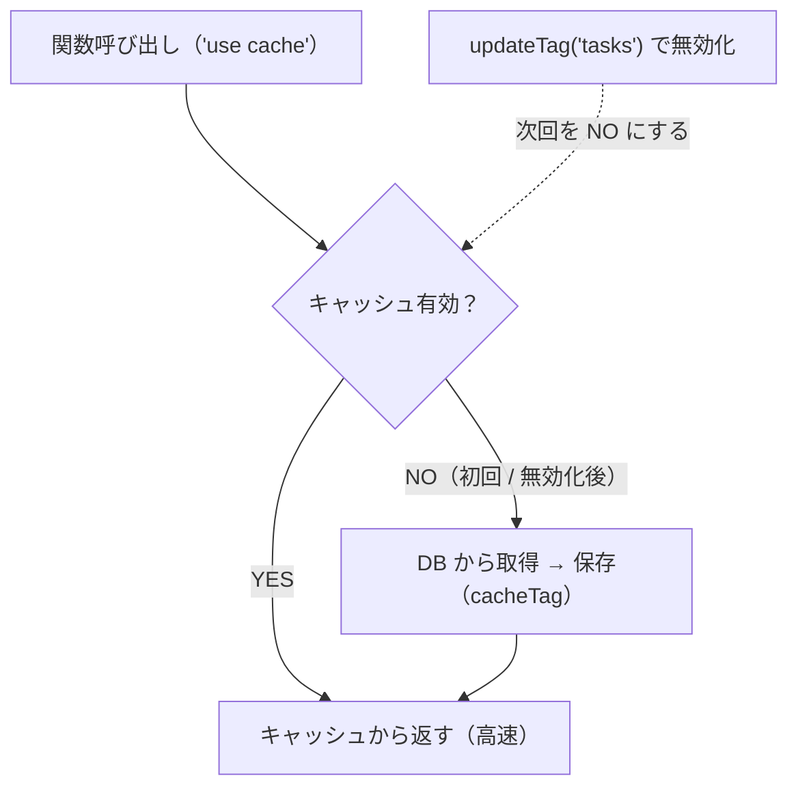

# 第 07 章：Cache Components

## この章の目標

> **CHECK**
> - [ ] `"use cache"` の仕組みを説明できる
> - [ ] `cacheTag` と `updateTag` の役割を説明できる
> - [ ] 取得系（`getTasks` / `getTaskById`）に `"use cache"` を付けられる
> - [ ] 作成・更新・削除後に `updateTag` でキャッシュを無効化できる
> - [ ] `auth.api.getSession()` をキャッシュしてはいけない理由を説明できる

---

> [!IMPORTANT]
> **`lib/cache/tags.ts` はリポジトリに同梱済みです。** 仕組みを理解しながら使ってください。
>
> ```bash
> git show answer/main:lib/cache/tags.ts
> ```

---

## 7-1. なぜキャッシュ制御が必要か

Next.js は高速化のためレスポンスをキャッシュしますが、放置すると「更新したのに画面が古いまま」になります。**Cache Components**（`"use cache"`）で、**何をキャッシュし・いつ無効化するか**を明示的に制御します。



---

## 7-2. `"use cache"` / `cacheTag` / `updateTag`

| 関数             | 役割                             |
| ---------------- | -------------------------------- |
| `"use cache"`    | その関数の結果をキャッシュする   |
| `cacheTag(tag)`  | キャッシュにタグを付ける         |
| `updateTag(tag)` | そのタグのキャッシュを無効化する |

```typescript
// 読み取り：タグを付けてキャッシュ
export const getTasks = async (query) => {
  "use cache";
  cacheTag(CACHE_TAGS.TASKS);
  return taskService.getTasksByQuery(query);
};

// 書き込み：無効化（Server Action 内で呼ぶ）
updateTag(CACHE_TAGS.TASKS);
```

> NOTE
> `"use cache"` は Next.js 16 の機能で、`next.config.ts` の `cacheComponents: true` で有効化されています（同梱済み）。

---

## 7-3. キャッシュタグ定数（`lib/cache/tags.ts`）

タグ文字列のハードコードは typo の元なので定数化します（**同梱済み**）。

```typescript
// lib/cache/tags.ts
export const CACHE_TAGS = {
  TASKS: "tasks",
  DASHBOARD: "dashboard",
} as const;

export type CacheTag = (typeof CACHE_TAGS)[keyof typeof CACHE_TAGS];
```

---

## 7-4. Server Actions にキャッシュを追加する

第 05 章で作った `actions/tasks.ts` に、**取得系（キャッシュあり）**と**無効化ヘルパー**を追記し、ミューテーションから無効化を呼びます。

```typescript
// app/(authed)/tasks/actions/tasks.ts（第 05 章に追記）
"use server";

import { cacheTag, updateTag } from "next/cache";
import { redirect } from "next/navigation";
import { CACHE_TAGS } from "@/lib/cache/tags";
import { createTaskSchema, type Task } from "@/lib/db/schema";
import { taskService } from "@/lib/db/services/task-service";
import type { TaskQuery } from "@/lib/validation/task-query-validation";
import { validationError, zodErrorToAppError } from "@/lib/errors";
import { err, isErr, type Result } from "@/lib/result";

// タスク変更後に呼ぶ：一覧とダッシュボードのキャッシュを無効化
const updateTasksCache = () => {
  updateTag(CACHE_TAGS.TASKS);
  updateTag(CACHE_TAGS.DASHBOARD);
};

// 一覧取得（キャッシュあり）
export const getTasks = async (query: TaskQuery = {}) => {
  "use cache";
  cacheTag(CACHE_TAGS.TASKS);
  return taskService.getTasksByQuery(query);
};

// 単件取得（キャッシュあり）
export const getTaskById = async (id: number): Promise<Result<Task>> => {
  "use cache";
  cacheTag(CACHE_TAGS.TASKS);
  return taskService.getTask(id);
};

// 第 05 章の createTask / updateTask / deleteTask に updateTasksCache() を追加する：
//   const result = await taskService.createTask(parseResult.data);
//   if (isErr(result)) return result;
//   updateTasksCache();      // ← 追記
//   redirect("/tasks");
// deleteTask も同様（削除成功後に updateTasksCache() を呼ぶ）
```

> NOTE
> - `getTasks` の引数は完成系では nuqs のパーサ型を使います（第 08 章で導入）。ここでは `TaskQuery`（`lib/validation`）で受けています。
> - `updateTag` は **必ず `"use server"` のコンテキスト（Server Action）内**で呼びます。
> - 第 05 章の `EditTaskForm` の `taskService.getTask` 直呼びを、ここで定義した `getTaskById`（キャッシュ付き）に置き換えます。

---

## 7-5. キャッシュの可視化はどこで効くか

`getTasks`（キャッシュ）と `updateTasksCache`（無効化）を仕込んだので、**この後それを使う画面**で効果が見えます。

- **第 08 章**：タスク一覧（`TaskList`）が `getTasks` を読む → 作成・削除すると即更新される
- **第 09 章**：ダッシュボード統計（`DASHBOARD` タグ）が同様に即更新される

> NOTE
> 一覧 UI は、URL フィルタ（nuqs）と削除ダイアログ（Zustand）が揃う第 08 章でまとめて組み立てます。ここでは「キャッシュの仕組み」を仕込むことに集中します。

---

## 7-6. なぜ `getSession` をキャッシュしてはいけないか

```typescript
// ❌ 絶対にやってはいけない
export async function getSession() {
  "use cache";
  return auth.api.getSession({ headers: await headers() });
  // → ユーザー A のセッションが B に返る可能性（リクエストスコープの値の混入）
}
```

リクエストスコープの値（ヘッダー・Cookie）はキャッシュに含めてはいけません。`AuthGate`（第 06 章）は**毎回 DB に問い合わせ**ています。

---

## まとめと次のステップ

- `"use cache"` でサーバー関数の結果をキャッシュし、`cacheTag` でタグ付けする
- 変更時は Server Action 内で `updateTag` を呼んで無効化する
- `CACHE_TAGS` 定数で typo を防ぐ
- `getSession()` はリクエストスコープの値を含むためキャッシュ禁止

次の第 08 章では **nuqs（URL フィルタ）と Zustand（削除ダイアログ）** を使い、タスク一覧 UI を組み立てます。

→ [第 08 章：nuqs + Zustand](./08-nuqs-zustand.md)
