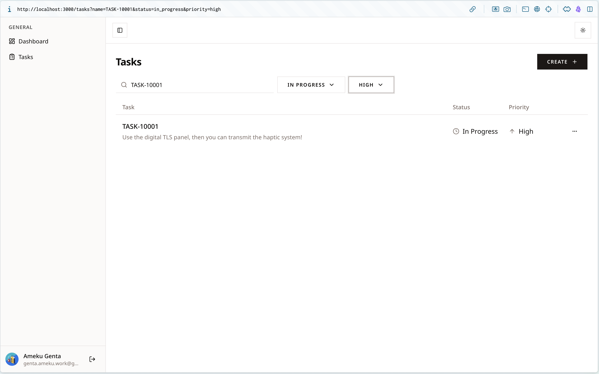
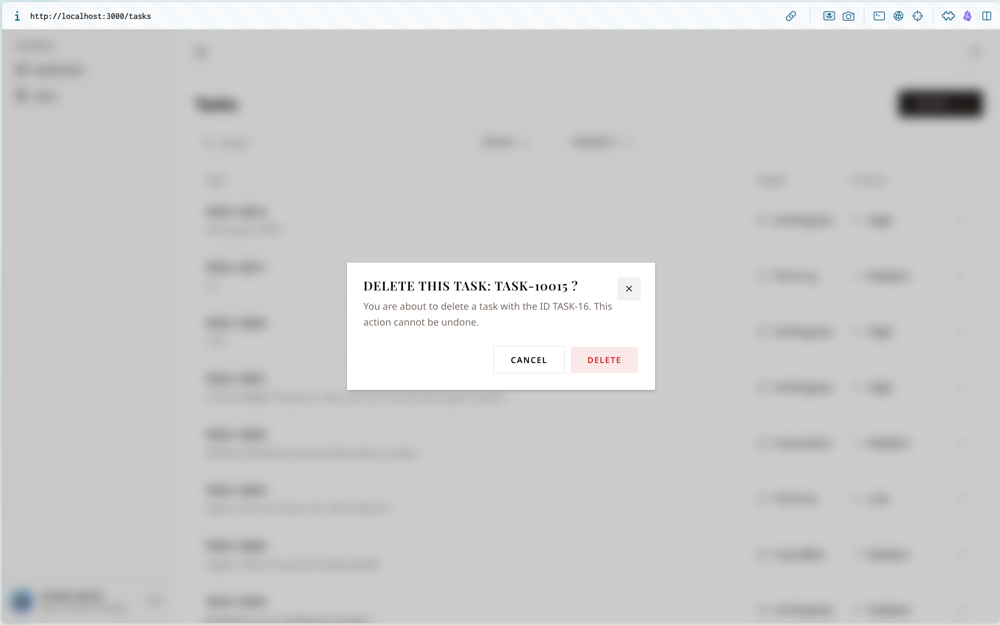

# 第 08 章：nuqs + Zustand（タスク一覧 UI）

## この章の目標

> **CHECK**
> - [ ] フィルタ条件が URL クエリに乗り、リロードしても保持される
> - [ ] Server と Client で同じパーサー定義（`searchParamsParsers`）を共有している
> - [ ] タスク一覧（`TaskList`）が `getTasks`（第 07 章のキャッシュ）から表示される
> - [ ] 作成・削除すると一覧が即更新される（キャッシュ無効化が効く）
> - [ ] Zustand で削除ダイアログの開閉を管理できる

---

> [!TIP]
> **一覧・フィルタ・行・ダイアログのマークアップは完成系からコピーして OK です。**
> この章の主目的は「**nuqs で URL とフィルタを同期**」「**Zustand でダイアログ状態を管理**」「**Server/Client でパーサーを共有**」の理解です。
>
> ```bash
> git show answer/main:app/\(authed\)/tasks/components/TaskList/presentational.tsx
> git show answer/main:app/\(authed\)/tasks/components/TaskList/components/TaskItem/index.tsx
> git show answer/main:app/\(authed\)/tasks/components/TaskFilters/index.tsx
> ```

---

## 8-1. なぜ URL に状態を持つのか

検索・フィルタ条件を URL クエリに入れます。

```
/tasks?name=login&status=in_progress&priority=high
```

- ブラウザの戻る / 進むでフィルタ状態を行き来できる
- URL を共有すれば同じフィルタ状態を共有できる
- リロードしても状態が保持される

---

## 8-2. `NuqsAdapter` をルートレイアウトに追加する

第 03 章のルートレイアウト（`app/layout.tsx`）に `NuqsAdapter` を**追記**します。

```tsx
// app/layout.tsx（NuqsAdapter を追記）
import { NuqsAdapter } from "nuqs/adapters/next/app";
// ...
<body className={/* ... */}>
  <NuqsAdapter defaultOptions={{ shallow: false }}>{children}</NuqsAdapter>
</body>
```

> NOTE
> `shallow: false` にすると、URL 変更時に Next.js のルーター経由で遷移し、**Server Component が再実行されてデータが再取得**されます。
> 第 10 章では、この `NuqsAdapter` の外側をさらに `ThemeProvider` で包みます。

---

## 8-3. パーサー定義（Server / Client 共通）

URL クエリの型を 1 か所で定義し、Server（一覧取得）と Client（フィルタ UI）の両方で共有します。

```typescript
// app/(authed)/tasks/lib/nuqs/searchParams.ts
import {
  createSearchParamsCache,
  parseAsString,
  parseAsStringEnum,
} from "nuqs/server";
import { PRIORITY, STATUS } from "@/lib/db/schema";

export const searchParamsParsers = {
  name: parseAsString.withDefault(""),
  status: parseAsStringEnum(Object.values(STATUS)),     // pending / in_progress / completed / cancelled
  priority: parseAsStringEnum(Object.values(PRIORITY)), // low / medium / high
};

// Server Component で searchParams を型安全にパースするためのキャッシュ
export const searchParamsCache = createSearchParamsCache(searchParamsParsers);
```

> NOTE
> `STATUS` / `PRIORITY`（第 04 章）から値を流用するので、**スキーマとフィルタの値が必ず一致**します。

---

## 8-4. タスク一覧を組み立てる（Server: container → presentational → TaskItem）

一覧は **container（サーバー・データ取得）→ presentational（表示）→ TaskItem（行）** に分けます。

```tsx
// app/(authed)/tasks/components/TaskList/container.tsx
import type { SearchParams } from "nuqs/server";
import { getTasks } from "@/app/(authed)/tasks/actions/tasks";
import { searchParamsCache } from "@/app/(authed)/tasks/lib/nuqs/searchParams";
import TaskListPresentational from "./presentational";

type TaskListContainerProps = {
  searchParams: Promise<SearchParams>;
};

export default async function TaskListContainer({
  searchParams,
}: TaskListContainerProps) {
  // URL クエリを型安全にパース（第 07 章のキャッシュ付き getTasks を呼ぶ）
  const parsedQuery = searchParamsCache.parse(await searchParams);
  const result = await getTasks(parsedQuery);
  const data = result.ok ? result.value : [];
  return <TaskListPresentational tasks={data} />;
}
```

> NOTE
> `presentational.tsx`（一覧の表）と `TaskItem`（行＋編集/削除メニュー）は完成系からコピーしてください。`TaskItem` の削除メニュー（`DeleteMenuItem`）は次の Zustand ストアを使います。

---

## 8-5. フィルタ UI（Client: nuqs `useQueryStates`）

```tsx
// app/(authed)/tasks/components/TaskFilters/index.tsx（完成系・コピー可）
"use client";

import { debounce, useQueryStates } from "nuqs";
import { searchParamsParsers } from "@/app/(authed)/tasks/lib/nuqs/searchParams";
import type { TaskPriority, TaskStatus } from "@/lib/db/schema";
import PriorityFilter from "./components/PriorityFilter";
import SearchFilter from "./components/SearchFilter";
import StatusFilter from "./components/StatusFilter";

export default function TaskFilters() {
  // searchParamsParsers を共有 → URL と状態を同期
  const [query, setQuery] = useQueryStates(searchParamsParsers);

  return (
    <div className="flex items-center gap-2 mb-4">
      <SearchFilter
        searchValue={query.name}
        onSearchChange={(v) =>
          setQuery({ name: v }, { limitUrlUpdates: debounce(500) })
        }
      />
      <StatusFilter
        selectedStatus={query.status}
        onStatusChange={(v: TaskStatus | null) => setQuery({ status: v })}
      />
      <PriorityFilter
        selectedPriority={query.priority}
        onPriorityChange={(v: TaskPriority | null) => setQuery({ priority: v })}
      />
    </div>
  );
}
```

> NOTE
> 検索入力は `debounce(500)` で URL 更新を間引きます。各 Filter サブコンポーネント（`SearchFilter` / `StatusFilter` / `PriorityFilter`）は完成系からコピーしてください。`StatusFilter` / `PriorityFilter` は第 05 章でコピーした `tasks/constants/index.ts`（`STATUS_OPTIONS` / `PRIORITY_OPTIONS`）を再利用します。

---

## 8-6. 削除ダイアログ（Zustand）

「行の削除メニュー」と「ダイアログ本体」は離れた場所にあるので、開閉状態を **Zustand** で共有します。

```typescript
// app/(authed)/tasks/stores/delete-task-dialog-store.ts
import { create } from "zustand";

interface DeleteTaskDialogStore {
  isOpen: boolean;
  taskId: number | null;
  taskName: string | null;
  open: (taskId: number, taskName: string) => void;
  close: () => void;
}

export const useDeleteTaskDialogStore = create<DeleteTaskDialogStore>((set) => ({
  isOpen: false,
  taskId: null,
  taskName: null,
  open: (taskId, taskName) => set({ isOpen: true, taskId, taskName }),
  close: () => set({ isOpen: false, taskId: null, taskName: null }),
}));
```

ダイアログ本体は shadcn の **`Dialog`** を使います（`alert-dialog` ではありません）。

```tsx
// app/(authed)/tasks/components/DeleteTaskDialog/index.tsx
"use client";

import { deleteTask } from "@/app/(authed)/tasks/actions/tasks";
import { useDeleteTaskDialogStore } from "@/app/(authed)/tasks/stores/delete-task-dialog-store";
import { Button } from "@/components/ui/button";
import {
  Dialog,
  DialogContent,
  DialogDescription,
  DialogFooter,
  DialogHeader,
  DialogTitle,
} from "@/components/ui/dialog";

export function DeleteTaskDialog() {
  const { isOpen, taskId, taskName, close } = useDeleteTaskDialogStore();

  const handleDelete = async () => {
    if (taskId === null) return;
    await deleteTask(taskId); // 第 07 章で updateTasksCache 済み → 一覧が即更新
    close();
  };

  if (taskId === null || taskName === null) return null;

  return (
    <Dialog open={isOpen} onOpenChange={(open) => !open && close()}>
      <DialogContent>
        <DialogHeader>
          <DialogTitle>Delete this task: {taskName} ?</DialogTitle>
          <DialogDescription>
            You are about to delete a task with the ID TASK-{taskId}. This action
            cannot be undone.
          </DialogDescription>
        </DialogHeader>
        <DialogFooter>
          <Button variant="outline" onClick={close}>
            Cancel
          </Button>
          <Button variant="destructive" onClick={handleDelete}>
            Delete
          </Button>
        </DialogFooter>
      </DialogContent>
    </Dialog>
  );
}
```

行の削除メニュー（`DeleteMenuItem`）は、ストアの `open(taskId, taskName)` を呼んでダイアログを開きます（完成系からコピー）。

```bash
git show answer/main:app/\(authed\)/tasks/components/TaskList/components/TaskItem/components/DeleteMenuItem/index.tsx
```

---

## 8-7. `page.tsx` で組み合わせる

```tsx
// app/(authed)/tasks/page.tsx
import { Plus } from "lucide-react";
import Link from "next/link";
import type { SearchParams } from "nuqs/server";
import { Suspense } from "react";
import { Button } from "@/components/ui/button";
import { DeleteTaskDialog } from "./components/DeleteTaskDialog";
import TaskFilters from "./components/TaskFilters";
import TaskList from "./components/TaskList/container";
import TaskListSkeleton from "./components/TaskListSkeleton";

type TaskPageProps = {
  searchParams: Promise<SearchParams>;
};

export default function TasksPage({ searchParams }: TaskPageProps) {
  return (
    <div className="space-y-4">
      <div className="flex items-center justify-between gap-2">
        <h2 className="text-2xl font-bold tracking-tight">Tasks</h2>
        <Button className="space-x-1" asChild>
          <Link href="/tasks/create">
            <span>Create</span> <Plus size={18} />
          </Link>
        </Button>
      </div>
      <Suspense fallback={<TaskListSkeleton />}>
        <TaskFilters />
        <TaskList searchParams={searchParams} />
      </Suspense>
      {/* Zustand で制御されるのでどこに置いてもよい */}
      <DeleteTaskDialog />
    </div>
  );
}
```

> NOTE
> `TaskListSkeleton` は完成系からコピーしてください。`TaskList`（container）に `searchParams`（`Promise`）をそのまま渡します。

---

## 8-8. 動作確認

```bash
pnpm dev
```

1. `/tasks` で一覧が表示される
2. 検索ボックス入力 → URL が `?name=...` に変化（500ms デバウンス）
3. ステータス / 優先度で絞り込み → URL に反映、リロードで保持
4. 「Create」でタスク作成 → 一覧が**即更新**（第 07 章のキャッシュ無効化）
5. 行のメニュー → Delete → ダイアログ → 削除で一覧が即更新

> TRY
> - ブラウザの「戻る」で前のフィルタ状態に戻れるか確認
> - URL に直接 `?status=completed` を入力して反映されるか確認

---

## まとめと次のステップ

- nuqs でフィルタを URL に同期し、`searchParamsParsers` を Server/Client で共有する
- `searchParamsCache.parse` で Server Component が URL から型安全にデータ取得する
- `NuqsAdapter` の `shallow: false` で URL 変更時に Server Component が再実行される
- Zustand で削除ダイアログの状態をコンポーネント間共有する

次の第 09 章では **ダッシュボード統計**と**本番ビルド**で仕上げます。

→ [第 09 章：仕上げ：Dashboard + デプロイ準備](./09-finishing.md)

---

## 完成イメージ



