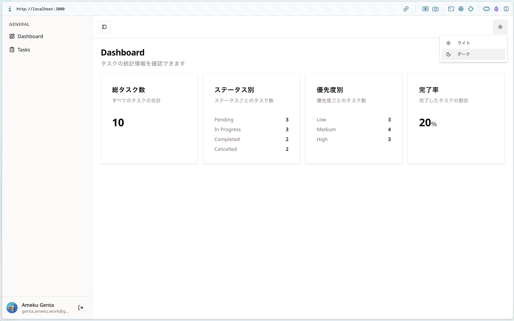

# 第 10 章：テーマを導入してみよう

## この章の目標

> **CHECK**
> - [ ] `next-themes` を使ったテーマ切り替えの仕組みを説明できる
> - [ ] `ThemeProvider` を `layout.tsx` に組み込める
> - [ ] `ToggleThemeButton` を実装してヘッダーに配置できる
> - [ ] ライト / ダークを切り替えて画面が変化することを確認できる
> - [ ] **TRY**：新しいカラーテーマ（例: ocean）を自分で追加できる

---

> [!IMPORTANT]
> **【コピー OK】`lib/constants/themes.ts` はリポジトリに同梱済みです。**
> 本章では仕組みを理解しながらコピーで進めて構いません。
>
> ```bash
> git show answer/main:lib/constants/themes.ts   # テーマ定数定義
> ```

---

## 10-1. テーマ切り替えの仕組み

### 全体像

ダークモードやカラーテーマの切り替えは、次の 3 層で実現しています。

```
[ユーザーがボタンをクリック]
         ↓
[next-themes が <html class="dark"> を付与 / 変更]
         ↓
[CSS の変数が切り替わる（:root → .dark の変数が有効になる）]
         ↓
[Tailwind の bg-background / text-foreground などが新しい色を参照]
         ↓
[画面全体の色が変わる]
```

それぞれの役割を整理します。

| レイヤー | 担当 | 場所 |
|---|---|---|
| テーマ管理 | `next-themes` | `components/ThemeProvider.tsx` |
| テーマ定義 | `THEMES` 定数 | `lib/constants/themes.ts` |
| 色の切り替え | CSS 変数 | `app/globals.css` |
| 切り替えボタン | `ToggleThemeButton` | `components/AppHeader/` |

---

## 10-2. CSS 変数と `@custom-variant dark` の連携

`app/globals.css` を確認してみましょう。

```bash
cat app/globals.css
```

以下の 3 つのセクションが核心部分です。

### ① `@custom-variant dark`

```css
@custom-variant dark (&:is(.dark *));
```

`<html>` 要素に `.dark` クラスが付いたとき、Tailwind の `dark:` プレフィックスが有効になる定義です。next-themes はこの `.dark` クラスを自動的に付与 / 除去します。

### ② `:root`（ライトテーマ）

```css
:root {
  --background: oklch(1 0 0);    /* 白 */
  --foreground: oklch(0.147 0.004 49.3); /* ほぼ黒 */
  --primary: oklch(0.214 0.009 43.1);
  /* ... */
}
```

デフォルトの色定義。`class="light"` または何もクラスがないときに適用されます。

### ③ `.dark`（ダークテーマ）

```css
.dark {
  --background: oklch(0.147 0.004 49.3); /* ほぼ黒 */
  --foreground: oklch(0.986 0.002 67.8); /* 白 */
  /* ... */
}
```

`.dark` クラスが付いたときに `:root` の変数を上書きします。これだけで Tailwind のすべての色が反転します。

> NOTE
> `oklch(明度 彩度 色相)` は新しいカラー記法です。
> 明度 `0` は黒、`1` は白です。
> 直感的に明度を調整できるため、ダークテーマの変数設計に向いています。

---

## 10-3. `next-themes` の仕組み

**next-themes** は React のコンテキストを使って、アプリ全体のテーマを管理するライブラリです。

```bash
# インストール（この章では既に済んでいます）
pnpm add next-themes
```

主に 2 つの機能を使います。

```tsx
// ThemeProvider：テーマを管理するコンテキスト
import { ThemeProvider } from "next-themes";

// useTheme：どのコンポーネントからでも現在のテーマを取得・変更できる
import { useTheme } from "next-themes";

const { theme, setTheme } = useTheme();
// theme → "light" | "dark" | "ocean" など
// setTheme("dark") → テーマを変更（localStorage に保存される）
```

`attribute="class"` を設定することで、`<html class="dark">` のような CSS クラスでテーマを表現します。これが `.dark { ... }` の CSS と連携する仕組みです。

---

## 10-4. テーマ定義（`THEMES` 定数）

テーマをハードコードせず、定数として一元管理します。

```bash
cat lib/constants/themes.ts
```

```typescript
// lib/constants/themes.ts
import { type LucideIcon, Moon, Sun } from "lucide-react";

export type ThemeDef = {
  /** next-themes が使用するテーマ識別子。globals.css のクラス名と一致させること */
  id: string;
  label: string;
  Icon: LucideIcon;
};

export const THEMES: ThemeDef[] = [
  { id: "light", label: "ライト", Icon: Sun },
  { id: "dark", label: "ダーク", Icon: Moon },
];

// ThemeProvider の themes プロパティに渡す ID 配列
export const THEME_IDS = THEMES.map((t) => t.id);
```

**なぜ定数で管理するのか？**

- テーマを追加するとき、`THEMES` に 1 エントリ追加するだけでドロップダウンに自動で反映される
- ハードコードが分散しない（`globals.css` と `themes.ts` の 2 箇所だけ変更すれば良い）

---

## 10-5. ハンズオン：テーマ切り替えを実装する

### Step 1：`ThemeProvider` を作る

`components/ThemeProvider.tsx` を作成します。

```bash
mkdir -p components
touch components/ThemeProvider.tsx
```

```tsx
// components/ThemeProvider.tsx
"use client";

import { ThemeProvider as NextThemesProvider } from "next-themes";
import type { ComponentProps } from "react";

// next-themes の ThemeProvider をそのまま re-export するラッパー。
// "use client" をここで閉じ込めることで、layout.tsx を Server Component のまま保てる。
export function ThemeProvider({
  children,
  ...props
}: ComponentProps<typeof NextThemesProvider>) {
  return <NextThemesProvider {...props}>{children}</NextThemesProvider>;
}
```

> NOTE
> `layout.tsx` はデフォルトで Server Component です。
> `"use client"` は Server Component に書けないため、ラッパーで分離しています。
> このパターンは next-themes の公式ドキュメントでも推奨されています。

### Step 2：`THEMES` 定数を作る

```bash
mkdir -p lib/constants
touch lib/constants/themes.ts
```

```typescript
// lib/constants/themes.ts
import { type LucideIcon, Moon, Sun } from "lucide-react";

export type ThemeDef = {
  id: string;
  label: string;
  Icon: LucideIcon;
};

export const THEMES: ThemeDef[] = [
  { id: "light", label: "ライト", Icon: Sun },
  { id: "dark", label: "ダーク", Icon: Moon },
];

export const THEME_IDS = THEMES.map((t) => t.id);
```

### Step 3：`layout.tsx` に `ThemeProvider` を追加する

```tsx
// app/layout.tsx（追加する部分のみ）
import { ThemeProvider } from "@/components/ThemeProvider";
import { THEME_IDS } from "@/lib/constants/themes";

export default function RootLayout({ children }) {
  return (
    <html lang="ja" suppressHydrationWarning ...>
      {/*
       * suppressHydrationWarning が必要な理由:
       * next-themes は初回レンダリング時に <html> の class 属性を
       * localStorage の値で書き換える。
       * この変更はサーバーの HTML と異なるため、React の hydration 警告が出る。
       * suppressHydrationWarning でその警告だけを無視する（バグではない）。
       */}
      <body ...>
        <ThemeProvider
          attribute="class"    {/* <html class="dark"> の形式でテーマを表現 */}
          themes={THEME_IDS}   {/* 使用可能なテーマの ID 一覧 */}
          defaultTheme="light" {/* localStorage になければ "light" を使う */}
          enableSystem={false} {/* OS のダークモード設定には追従しない */}
          disableTransitionOnChange {/* 切替時のチカチカを防ぐ */}
        >
          {children}
        </ThemeProvider>
      </body>
    </html>
  );
}
```

### Step 4：`ToggleThemeButton` を作る

> [!TIP]
> **`ToggleThemeButton` の JSX（ドロップダウンのマークアップ）はリポジトリからコピーして進めて OK です。**
> 本章のメインは「`useTheme` でテーマを切り替える仕組み」と「`THEMES` 定数との連携」の理解です。
> 自分でデザインを変えたい場合は自由に書き換えてください。
>
> ```bash
> git show answer/main:components/AppHeader/components/ToggleThemeButton/index.tsx
> ```

```bash
mkdir -p components/AppHeader/components/ToggleThemeButton
touch components/AppHeader/components/ToggleThemeButton/index.tsx
```

```tsx
// components/AppHeader/components/ToggleThemeButton/index.tsx
"use client";

import { useTheme } from "next-themes";
import { Button } from "@/components/ui/button";
import {
  DropdownMenu,
  DropdownMenuContent,
  DropdownMenuRadioGroup,
  DropdownMenuRadioItem,
  DropdownMenuTrigger,
} from "@/components/ui/dropdown-menu";
import { THEMES } from "@/lib/constants/themes";

export default function ToggleThemeButton() {
  // useTheme で現在のテーマと変更関数を取得する
  const { theme, setTheme } = useTheme();

  // 現在のテーマに対応するアイコンを動的に取得する
  const currentTheme = THEMES.find((t) => t.id === theme) ?? THEMES[0];
  const CurrentIcon = currentTheme.Icon;

  return (
    <DropdownMenu>
      <DropdownMenuTrigger asChild>
        <Button variant="outline" size="icon" aria-label="テーマを選択">
          <CurrentIcon />
        </Button>
      </DropdownMenuTrigger>
      <DropdownMenuContent align="end">
        {/* ラジオグループでテーマを 1 つだけ選択できるようにする */}
        <DropdownMenuRadioGroup value={theme} onValueChange={setTheme}>
          {THEMES.map(({ id, label, Icon }) => (
            <DropdownMenuRadioItem key={id} value={id}>
              <Icon className="mr-2 h-4 w-4" />
              {label}
            </DropdownMenuRadioItem>
          ))}
        </DropdownMenuRadioGroup>
      </DropdownMenuContent>
    </DropdownMenu>
  );
}
```

### Step 5：`AppHeader` に組み込む

```tsx
// components/AppHeader/index.tsx
import { SidebarTrigger } from "@/components/ui/sidebar";
import ToggleThemeButton from "./components/ToggleThemeButton";

export default function AppHeader() {
  return (
    <div className="flex h-16 shrink-0 items-center gap-2 border-b px-4">
      <SidebarTrigger variant="outline" />
      {/* ml-auto で右端に押し出す */}
      <div className="ml-auto">
        <ToggleThemeButton />
      </div>
    </div>
  );
}
```

### Step 6：動作確認

```bash
pnpm dev
```

1. `http://localhost:3000` を開く
2. ヘッダー右上のアイコンボタンをクリック
3. 「ダーク」を選択 → 画面全体が暗くなることを確認
4. 「ライト」に戻す → 元に戻ることを確認
5. ページをリロード → テーマが**保持されている**ことを確認（localStorage に保存されるため）

<details>
<summary>HINT：ボタンは表示されるがテーマが切り替わらない場合</summary>

- `layout.tsx` に `suppressHydrationWarning` が付いているか確認
- `ThemeProvider` が `children` を正しく包んでいるか確認
- `attribute="class"` が設定されているか確認（これがないと CSS と連携しない）

</details>

<details>
<summary>HINT：DropdownMenu が見つからない場合</summary>

shadcn の DropdownMenu をインストールします：

```bash
pnpm dlx shadcn@latest add dropdown-menu
```

</details>

---

## 10-6. TRY：新しいカラーテーマを追加してみよう

ここからが本番です。**オリジナルのカラーテーマ**を追加してみましょう。

### 手順

#### ① `lib/constants/themes.ts` にエントリを追加

好きなアイコンを選んで追加します（`lucide-react` のアイコンは [lucide.dev](https://lucide.dev) で探せます）。

```typescript
// lib/constants/themes.ts
import { type LucideIcon, Moon, Sun, Waves } from "lucide-react"; // ← アイコン追加

export const THEMES: ThemeDef[] = [
  { id: "light", label: "ライト", Icon: Sun },
  { id: "dark", label: "ダーク", Icon: Moon },
  { id: "ocean", label: "オーシャン", Icon: Waves }, // ← 追加
];
```

#### ② `app/globals.css` にカラーパレットを追加

```css
/* app/globals.css — 追加テーマ用コメントの下に追加する */

.ocean {
  --background: oklch(0.96 0.025 220);
  --foreground: oklch(0.15 0.03 220);
  --card: oklch(0.92 0.02 220);
  --card-foreground: oklch(0.15 0.03 220);
  --primary: oklch(0.45 0.18 220);
  --primary-foreground: oklch(0.98 0.005 220);
  --secondary: oklch(0.88 0.03 220);
  --secondary-foreground: oklch(0.2 0.04 220);
  --muted: oklch(0.88 0.03 220);
  --muted-foreground: oklch(0.45 0.06 220);
  --border: oklch(0.82 0.04 220);
  --input: oklch(0.82 0.04 220);
  --ring: oklch(0.45 0.18 220);
}
```

> NOTE
> `oklch(明度 彩度 色相)` の色相値で雰囲気が決まります。
> - 220 付近 = 青（オーシャン）
> - 150 付近 = 緑（フォレスト）
> - 30 付近 = 暖色（アンバー）
>
> 明度を高くするとライトテーマ、低くするとダークテーマっぽくなります。

#### ③ 動作確認

1. `pnpm dev` を起動してヘッダーのテーマボタンを押す
2. 「オーシャン」が選択肢に現れることを確認
3. 選択すると青系の画面になることを確認

> TRY（チャレンジ）
> - 自分好みのカラーパレットを作ってみましょう
> - ダーク系のカラーテーマ（例: `midnight`）を追加してみましょう
> - サイドバーの色も変えたい場合は `--sidebar` 系の変数も追加できます

---

## 10-7. テーマシステムの設計を振り返る

この章で実装したテーマシステムは **拡張しやすい設計** になっています。

```
テーマを追加するときの変更箇所:
  ① lib/constants/themes.ts  ← テーマの ID・ラベル・アイコンを追加
  ② app/globals.css          ← カラーパレットを定義

変更しなくていい箇所:
  ✅ ThemeProvider.tsx       ← 変更不要
  ✅ ToggleThemeButton.tsx   ← THEMES を読むので自動で反映
  ✅ layout.tsx              ← THEME_IDS を使うので自動で反映
  ✅ Tailwind クラス          ← CSS 変数を参照しているので自動で反映
```

これは **設定と実装を分離する** 設計パターンです。テーマの「種類」は定数ファイルに集約し、「実際の処理」は定数を読んで動作するようにしています。

新しいテーマを追加するときに「どこを変えればいい？」と迷わなくて済むのが、この設計の利点です。

---

## まとめ

この章では以下を実装しました：

- `next-themes` でテーマを管理し、`<html class="dark">` の形で CSS と連携させる
- CSS 変数（`:root` / `.dark` / `.ocean` ...）を切り替えることで全体のカラーが変わる
- `THEMES` 定数を 1 か所で管理し、定数を追加するだけで新しいテーマが反映される仕組み
- `suppressHydrationWarning` が必要な理由（localStorage ↔ サーバーの HTML の差異）

→ [第 11 章：Result 型 / Repository 層（より深く）](./11-result-repository.md)

---

## 完成イメージ

この章を完了すると、画面はおおむね以下のようになります。


