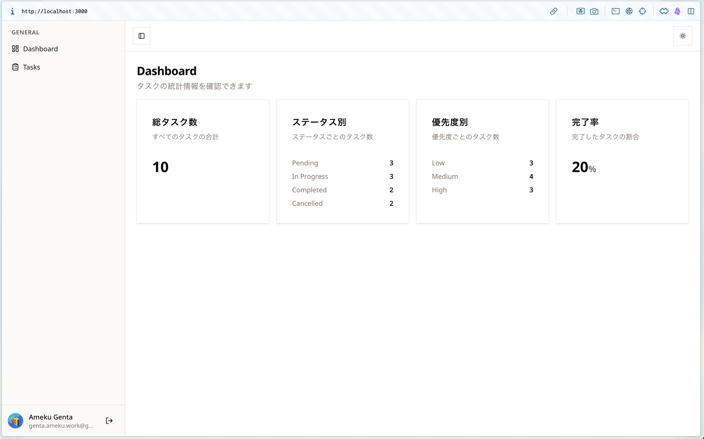
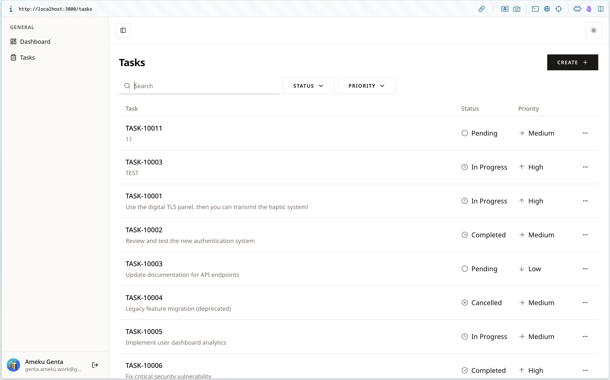
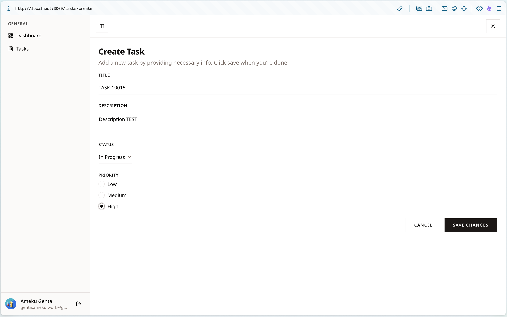
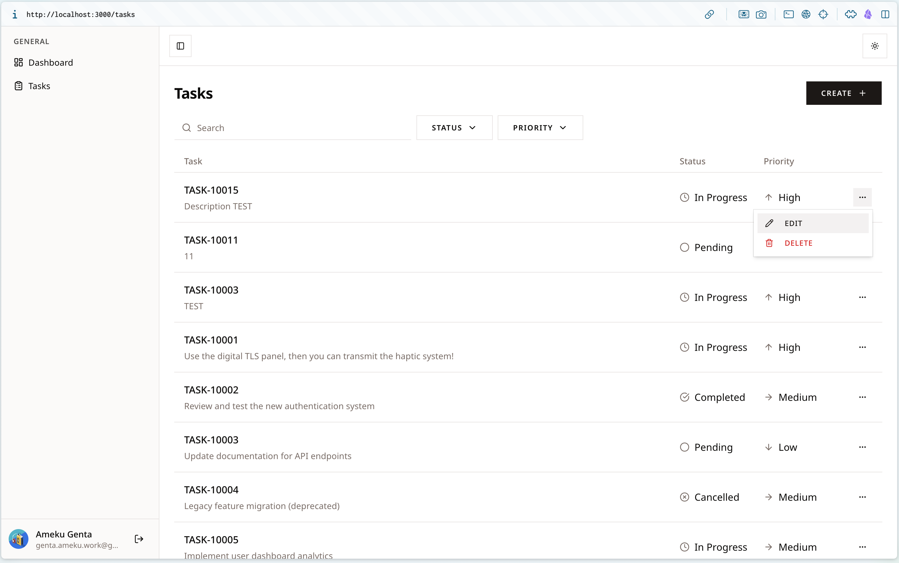
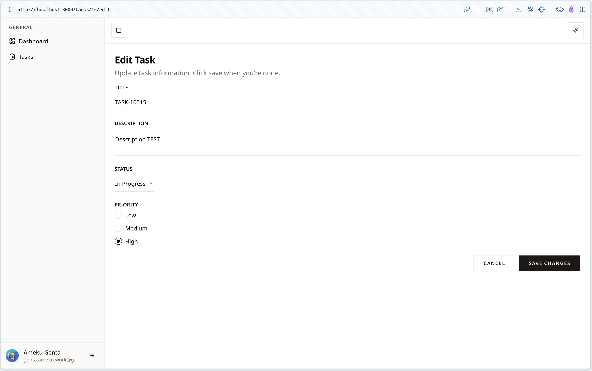
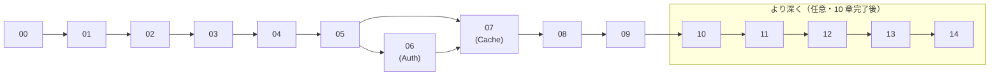

# フロントエンドエンジニア向け ハンズオン研修

このドキュメント群は、**dashboard-playground-nextjs** を題材に Next.js アプリケーションをゼロから作り上げる研修用の手順書です。

> [!TIP]
> 仕組みから理解したい方へ：<a href="/nextjs-dashboard-training/slides/how-nextjs-works.html" target="_blank" rel="noopener">「Next.js のウェブアプリはどう動くのか？」図解スライド</a>（別タブで開きます）

---

## 研修の目標

このリポジトリを自分の手で**再実装できる**ようになること。最終的には以下がすべて動く状態を目指します。

- Google アカウントでログイン / ログアウト
- タスクの作成・一覧・編集・削除
- 検索とフィルタリング（URL に状態を持つ）
- ダッシュボードにタスク統計を表示
- `pnpm build && pnpm start` で本番起動

---

## 対象読者

- Next.js の経験が約半年ある方（App Router の基本は知っているが、Server Actions・Cache Components・RSC の動きが曖昧な方）
- TypeScript・React が読み書きできる方

---

## 章構成・所要時間

| #    | 章タイトル                         | 到達点                                                          | 実装種別             | タグ        | 時間    |
| ---- | ---------------------------------- | --------------------------------------------------------------- | -------------------- | ----------- | ------- |
| [00](./00-orientation.md) | はじめに / 完成形ツアー   | 完成版を動かし、画面・URL・データの対応をイメージできる         | 体験                 | —           | 30 分   |
| [01](./01-foundation.md)  | プロジェクト基盤の仕組み  | リポジトリをクローンし `pnpm dev` で初期ページ表示。RSC・Biome・Lefthook を説明可 | フロントエンド | —           | 90 分   |
| [02](./02-tailwind-shadcn.md) | Tailwind v4 + shadcn/ui | `globals.css` の `@theme` を理解し、shadcn コンポーネントを表示 | フロントエンド  | —           | 60 分   |
| [03](./03-routing.md)     | App Router・layout・ルート | `/login`・`/`・`/tasks` の遷移と共通レイアウトが見える          | フロントエンド       | —           | 60 分   |
| [04](./04-drizzle-sqlite.md) | Drizzle + SQLite        | `tasks` テーブルを定義し Drizzle Studio で確認できる            | バックエンド         | **必須**    | 60 分   |
| [05](./05-server-actions.md) | Server Actions + フォーム | `/tasks/create` で送信すると SQLite に行が増える               | フロントエンド       | —           | 120 分  |
| [06](./06-better-auth.md) | Better Auth + Google OAuth | Google ログイン→ログアウトと二段認証ガードが機能する           | フロントエンド       | —           | 120 分  |
| [07](./07-cache-components.md) | Cache Components      | タスク作成後に一覧・統計が即更新される                          | フロントエンド       | —           | 75 分   |
| [08](./08-nuqs-zustand.md) | nuqs + Zustand          | フィルタが URL に反映、削除ダイアログが Zustand で開閉する       | フロントエンド       | —           | 75 分   |
| [09](./09-finishing.md)   | 仕上げ：Dashboard + デプロイ準備 | ダッシュボード統計が表示され `pnpm start` で本番起動できる | フロントエンド  | —           | 60 分   |
| [10](./10-theme.md)       | テーマを導入してみよう    | ライト/ダーク切り替えが動き、オリジナルのカラーテーマを自分で追加できる | フロントエンド | —     | 60 分   |
| [11](./11-result-repository.md) | Result 型 / Repository 層 | `taskRepository` の中身を理解する                          | バックエンド         | **より深く** | 90 分   |
| [12](./12-zod-service.md) | Zod + Service 層         | `taskService` の中身を理解する                                  | バックエンド         | **より深く** | 60 分   |
| [13](./13-vitest-biome.md) | Vitest でテストを書く    | 全テストが緑になる                                              | バックエンド         | **より深く** | 60 分   |
| [14](./14-react-compiler.md) | React Compiler + Turbopack | `useMemo` を書かない設計の理由を説明できる（読み物中心）    | 読み物               | **より深く** | 30 分   |

**合計 約 17〜21 時間（研修 2〜3 日想定）**

> **実装種別の意味**
> - **フロントエンド**: `app/` 配下（ページ・コンポーネント・Server Actions）を中心に実装する章
> - **バックエンド**: `lib/` 配下（DB スキーマ・Repository・Service・認証）を中心に実装する章
> - **体験**: コードを書かず完成版を動かして全体像を把握する章
> - **読み物**: 実装はなく概念・設計を理解する章
>
> **タグの意味**
> - **必須**: DB 環境セットアップのため全員が実施する章。コピーで素早く進めても OK。
> - **より深く**: `lib/` の中身を読み解くオプション章。第 10 章まで完了してから取り組むと理解が深まります。

---

## 完成画面ギャラリー

研修を完了すると、以下のすべての画面が動作します。











---

## 章間の依存関係

章は以下の順序で進めてください。矢印は「先に完了させる必要がある章」を示します。



| 依存の種類          | 具体例                                         |
| ------------------- | ---------------------------------------------- |
| **必須直列**        | 04 → 05（DB → Server Actions）                 |
| **並行可**          | 05 と 06 はどちらが先でも可（06 は認証レイヤー） |
| **より深く**        | 11–14 は 10 章完了後、いつでも取り組める        |

---

## 進め方（受講者向け）

### 1. 作業ブランチを切る

```bash
git switch -c training/<自分の名前>
# 例: git switch -c training/yamada
```

### 2. 回答リポジトリをリモートに登録する（初回のみ）

完成形のコードは別リポジトリで管理されています。以下を **一度だけ** 実行して `answer` という名前でリモートに登録してください。

```bash
git remote add answer https://github.com/GentaAmeku/dashboard-playground-nextjs
git fetch answer
```

以後、各章で `git show answer/main:path/to/file` の形式で完成形のファイルを確認できます。

### 3. JSX（見た目）はコピーして OK

各章で JSX コードブロックの前に `[!TIP]` Callout が出てきます。コンポーネントのマークアップは **`git show answer/main:...` でコピーして進めることを推奨** します。本章のメインはロジックの組み立て方の理解です。デザインを変えたい場合は自由に書き換えて構いません。

### 4. `lib/` はリポジトリに同梱済み

`lib/` 配下（DB・認証・Result 型・Repository・Service など）の完成形はすでにリポジトリに入っています。

- **04章（必須）**: コピーで進めて DB 環境だけ整える
- **06・07・10章（コピーOK）**: `lib/auth.ts` 等はコピーして設定の意味を読む
- **11–12章（より深く）**: 第 10 章完了後に中身を読み解く

### 5. 章の手順に従って実装する

各章の末尾に `> CHECK` という確認リストがあります。すべてにチェックが入ったら次の章へ進みます。

### 6. 詰まったら

各章の `<details>` ブロックが HINT です。**まず 30 分は自力で考えてください。** それでも解決しない場合は HINT を開き、さらに詰まったら [回答リポジトリ](https://github.com/GentaAmeku/dashboard-playground-nextjs) の完成形コードを参照します。

```bash
# 特定ファイルの答えを表示する（手順 2 で answer リモートを登録済みの場合）
git show answer/main:app/(authed)/tasks/actions/tasks.ts
```

### 7. 章ごとにコミットする

```bash
git add -p   # 変更を確認しながらステージング
git commit -m "ch05: Server Actions でタスク CRUD を実装"
```

最終的に PR を出して講師のレビューを受けます。

---

## 注意事項

- **`.env.local` は絶対にコミットしない**（`.gitignore` 済みですが念のため）
- **`local.db` もコミットしない**（`.gitignore` 済み）
- 第 06 章で Google OAuth を設定するため、事前に Google アカウントが必要です
- 不明点はチャットで連絡してください

---

## このリポジトリと手順書の関係

完成形のコードは [回答リポジトリ（dashboard-playground-nextjs）](https://github.com/GentaAmeku/dashboard-playground-nextjs) にあります。手順書は「**完成形を自分の手で再現する手引き**」です。

| 回答リポジトリ (`answer`)    | docs/training/（この手順書）      |
| ---------------------------- | --------------------------------- |
| 完成形コード                 | 作り方のガイド                    |
| いつでも参照可               | 30 分悩んでから開くことを推奨     |

---

## 補足ドキュメント

章の手順書とは別に、設計の背景を解説する読み物ドキュメントです。

| ドキュメント | 内容 |
| ------------ | ---- |
| [Server Actions アーキテクチャと REST API との違い](./appendix-backend-architecture.md) | このプロジェクトのバックエンド設計・RPC の仕組み・REST API との比較 |
| [ページ実装の設計思想（フロントエンド・アーキテクチャ）](./appendix-frontend-architecture.md) | 状態の置き場所・コンポーネントの責務・書き始めの手順・hook 分離・キャッシュ戦略 |

---

## 参考リンク

- [このリポジトリの README](https://github.com/GentaAmeku/nextjs-dashboard-training/blob/main/README.md)
- [CLAUDE.md（設計思想・コーディング規約）](https://github.com/GentaAmeku/nextjs-dashboard-training/blob/main/CLAUDE.md)
- [Next.js 公式ドキュメント](https://nextjs.org/docs)
- [Better Auth 公式ドキュメント](https://www.better-auth.com/docs)
- [Drizzle ORM 公式ドキュメント](https://orm.drizzle.team/docs)
