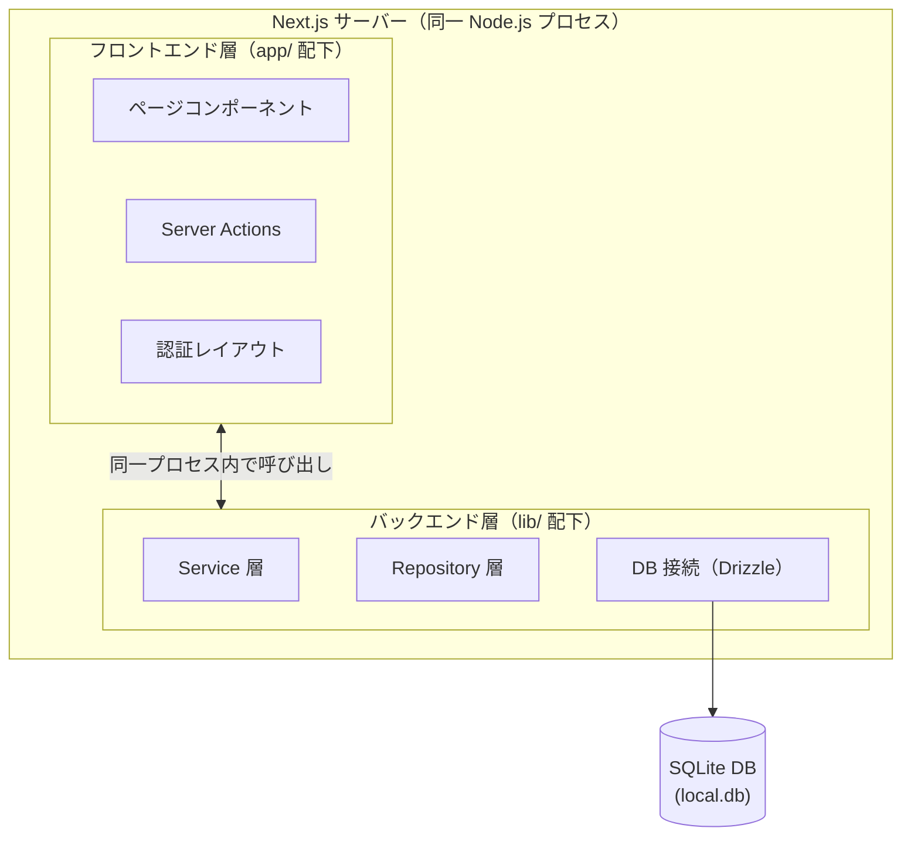
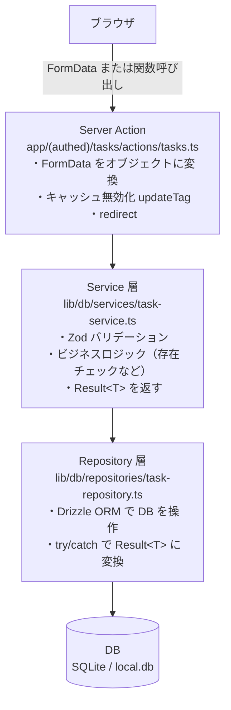

# 補足：Server Actions によるバックエンド設計と REST API との違い

この章は **読み物** です。実装タスクはありません。第 05 章（Server Actions）や第 11〜12 章（より深く）を進めるうえで「なぜこの設計なのか」を理解したい方向けに、アーキテクチャ全体を俯瞰します。

---

## A-1. このプロジェクトのバックエンドはどこにあるか

「バックエンドはどこのサーバーで動いているのか」と疑問に思ったことはありませんか？

このプロジェクトでは **Next.js サーバーの中にバックエンド処理が同居** しています。



**`app/` はフロントエンド層**、**`lib/` はバックエンド層** という役割分担ですが、両方とも同じ Node.js プロセスの中で動きます。別途 API サーバーを立てる必要はありません。

> NOTE
> 「サーバーサイドで動く処理」と「クライアントサイドで動く処理」の境界を管理するのが `'use server'` / `'use client'` ディレクティブです。Next.js がこの境界を自動的にネットワーク境界としてコンパイルします。

---

## A-2. Server Actions とは何か（RPC の仕組み）

### `'use server'` ディレクティブが何をするか

`'use server'` を付けた関数は、Next.js のコンパイラによって**サーバーサイドにバインドされた関数**になります。

```typescript
// app/(authed)/tasks/actions/tasks.ts
'use server';

// この関数はサーバーで実行される
export async function createTask(
  prev: Result<Task> | null,
  formData: FormData
): Promise<Result<Task>> {
  const data = Object.fromEntries(formData.entries());
  // ...taskService.createTask(data) を呼ぶ
}
```

クライアントコンポーネントから `createTask` を呼ぶと、表面上は「関数呼び出し」ですが、裏側では **HTTP POST リクエスト** が送信されています。

```mermaid
sequenceDiagram
    participant C as クライアント
    participant S as サーバー

    Note over C: useActionState(createTask, null)
    Note over C: &lt;form action={formAction}&gt; → フォーム送信
    C->>S: POST /_next/action<br/>FormData: { name: "...", ... }
    Note over S: createTask() を実行
    S-->>C: RSC ペイロード<br/>（更新後の画面差分データ）
```

これが **RPC（Remote Procedure Call）** の仕組みです。「離れた場所にある手続きを、あたかもローカルの関数のように呼び出す」パターンをそのままコードで表現できます。

### FormData で渡す場合と直接呼び出す場合

| 呼び出し方 | 使いどころ | コード例 |
|---|---|---|
| `useActionState` + `<form>` | フォーム送信 | タスク作成・編集フォーム |
| Server Action を直接 `await` | ボタン操作など | 削除ボタンのクリックハンドラ |

```typescript
// 直接呼び出す場合
'use client';

import { deleteTask } from "../actions/tasks";

export function DeleteButton({ id }: { id: number }) {
  return (
    <button onClick={() => deleteTask(id)}>
      削除
    </button>
  );
}
```

---

## A-3. このプロジェクトのレイヤー構成

データがどのように流れるかを追ってみましょう。



### A-3-1. Server Action の責務

Server Action は「**フォームとサーバー処理の橋渡し**」役です。ビジネスロジックは持ちません。

```typescript
export async function createTask(prev, formData) {
  'use server';

  // ① FormData を取り出す
  const data = Object.fromEntries(formData.entries());

  // ② Service に委譲（ビジネスロジックは Service が持つ）
  const result = await taskService.createTask(data);

  // ③ エラーなら Result を返す（フォームのエラー表示用）
  if (isErr(result)) return result;

  // ④ 成功したらキャッシュを更新してリダイレクト
  updateTag(CACHE_TAGS.TASKS);
  redirect('/tasks');
}
```

### A-3-2. Service 層の責務

Service は「**バリデーション + ビジネスロジック**」を担います。「何が許可されて何が許可されないか」のルールはここに集約します。

```typescript
// lib/db/services/task-service.ts
export async function createTask(data: unknown): Promise<Result<Task>> {
  // ① Zod でバリデーション（入力が正しい形式か）
  const parseResult = validateTaskData(data);
  if (!parseResult.success) {
    return err(zodErrorToAppError(parseResult.error));
  }

  // ② Repository に委譲（DB の操作は Repository が知っている）
  return taskRepository.create(parseResult.data);
}
```

### A-3-3. Repository 層の責務

Repository は「**DB アクセスのみ**」を担います。ビジネスルールは一切持ちません。

```typescript
// lib/db/repositories/task-repository.ts
export const taskRepository = {
  create: async (data: NewTask) => {
    try {
      const db = getDB();
      const [task] = await db.insert(schema.tasks).values(data).returning();
      return ok(task);
    } catch (error) {
      return err(databaseError("Failed to create task", error));
    }
  },
};
```

### A-3-4. Result 型（例外を投げない設計）

各レイヤーは **例外（throw）を使わず `Result<T>` を返します**。

```typescript
// lib/result.ts
type Result<T, E = AppError> = Ok<T> | Err<E>;

type Ok<T>  = { ok: true;  value: T };
type Err<E> = { ok: false; error: E };
```

**なぜ throw を使わないのか：**

```typescript
// ❌ throw を使う場合：エラーが型に現れない
async function createTask(): Promise<Task> {
  // この関数がどんなエラーを投げるか、型シグネチャを見ても分からない
}

// ✅ Result を使う場合：エラーが型に現れる
async function createTask(): Promise<Result<Task>> {
  // 成功時は Task、失敗時は AppError を返すことが型で保証される
}
```

エラーが型に現れることで、**コンパイル時にハンドリング漏れを検出できます**。

> NOTE
> このパターンは Rust の `Result<T, E>` や Haskell の `Either` に影響を受けた**型安全なエラー処理**の手法です。例外は「どこかで誰かがキャッチしてくれる」という暗黙の前提があり、大きなアプリケーションでは管理が難しくなります。

---

## A-4. REST API サーバーを別途立てる場合との違い

### 比較表

| 観点 | Server Actions（このプロジェクト） | REST API サーバー（別途）|
|---|---|---|
| **エンドポイント** | なし（関数 import で直接呼ぶ） | `POST /api/tasks` など URL を定義 |
| **型安全性** | TypeScript の型が自動で付く | OpenAPI / Zod で別途スキーマ管理が必要 |
| **認証** | 同一プロセスのセッション管理 | JWT / OAuth トークンの検証が必要 |
| **クライアント** | Next.js アプリのみ | ブラウザ・iOS・Android など複数対応可 |
| **デプロイ** | Next.js と一体でデプロイ | フロントとバックエンドを別々にデプロイ |
| **スケーリング** | フロントと同時にスケール | バックエンドだけ独立してスケール可 |
| **チーム分業** | フロントチームが一括管理しやすい | フロント・バック・モバイルチームが分業可 |
| **学習コスト** | Next.js を知っていれば十分 | HTTP・REST 設計・CORS などの知識が必要 |

### Server Actions が向く場面

- **モノリシックな Web アプリ**（クライアントが Next.js だけ）
- **小〜中規模プロジェクト**（チームが小さく、スケーリングが単純）
- **型安全を最優先したい**（フロントとバックエンドで型を共有したい）
- **素早くプロトタイプを作りたい**（エンドポイント設計が不要）

### REST API が向く場面

- **複数のクライアントがある**（Web + iOS + Android アプリなど）
- **外部に API を公開したい**（サードパーティが叩けるようにしたい）
- **フロントとバックエンドで別チームが開発**（リリースサイクルを分離したい）
- **バックエンドだけ独立してスケールさせたい**（トラフィックが偏る場合）

### 他の選択肢

| 技術 | 特徴 |
|---|---|
| **tRPC** | TypeScript の型安全を保ちながら REST ライクな API を定義できる。Server Actions と似た開発体験を Express など別サーバーでも実現できる |
| **GraphQL** | クライアントが必要なフィールドだけを取得できる柔軟なクエリ言語。複雑なデータグラフがあるプロジェクトに向く |
| **gRPC** | Protocol Buffers でスキーマを定義し、マイクロサービス間の通信に使われる |

> TIP
> 「まずは Server Actions でモノリスとして作り、スケールが必要になったときに API を切り出す」という進め方が現実的です。過度な早期分離は複雑さを増やすだけになりがちです。

---

## A-5. デプロイ時の動作

### Vercel / Node.js サーバーでの動作

開発中は `pnpm dev` で 1 プロセスが起動しますが、**本番環境（Vercel など）では Server Actions がサーバーレス関数として分解されて動きます**。

```
[開発環境]
  pnpm dev
  └── Next.js プロセス（1つ）
       ├── ページ配信
       ├── Server Actions の実行
       └── DB 接続（SQLite）

[本番環境 / Vercel]
  ├── 静的アセット（CDN から配信）
  ├── /_next/action（Server Actions → サーバーレス関数）
  └── /api/*（Route Handlers → サーバーレス関数）
```

### SQLite の制約と本番移行

このプロジェクトでは SQLite（`local.db` ファイル）を使っていますが、Vercel のようなサーバーレス環境では**ファイルシステムが永続化されない**ため、本番にそのままデプロイできません。

| DB | 開発 | 本番 |
|---|---|---|
| **SQLite（このプロジェクト）** | ✅ セットアップ不要 | ❌ サーバーレスと相性が悪い |
| **Turso**（分散 SQLite） | ✅ 使える | ✅ Vercel でも動く |
| **PostgreSQL / MySQL** | 起動が必要 | ✅ 一般的な選択肢 |

> NOTE
> 研修の次のステップとして「Turso + Vercel へのデプロイ」があります（第 09 章「仕上げ」の自主学習セクション参照）。

### Edge Runtime と Node.js Runtime の使い分け

このプロジェクトでは **2 つの Runtime** が混在しています。

| ファイル | Runtime | 理由 |
|---|---|---|
| `proxy.ts`（middleware） | **Edge Runtime** | 全リクエストに対して高速に処理する必要があるため。ただし `better-sqlite3` は動かないので Cookie チェックのみ |
| `app/(authed)/layout.tsx` の `AuthGate` | **Node.js** | `auth.api.getSession()` が DB にアクセスするため |
| Server Actions | **Node.js** | Drizzle（`better-sqlite3`）を使うため |

Edge Runtime は V8 エンジン上で動くが Node.js API の一部が使えない（ファイルシステム・ネイティブモジュールなど）。`better-sqlite3` はネイティブモジュールなので Edge では動きません。

---

## まとめ：このプロジェクトで学べること・学べないこと

### ✅ このプロジェクトで学べること

- **Server Actions による RPC パターン**（URL なしのサーバー呼び出し）
- **レイヤードアーキテクチャ**（Repository → Service → Server Action の責務分離）
- **型安全なエラーハンドリング**（Result 型、例外を使わない設計）
- **Next.js のキャッシュ戦略**（`"use cache"` / `updateTag` によるきめ細かな更新）
- **フルスタック開発の一体感**（フロントとバックが同じ TypeScript 型を共有）

### ⚠️ 別途学ぶ必要があること

- **REST API の設計**（URL 設計、HTTP メソッドの使い分け、ステータスコード）
- **OpenAPI / Swagger**（スキーマ定義と自動ドキュメント生成）
- **JWT 認証**（ステートレスなトークンベースの認証）
- **水平スケーリング**（複数インスタンスへのロードバランシング）
- **マイクロサービス**（サービスを細かく分割して独立デプロイする設計）

---

## 次に読む

このプロジェクトのバックエンド層の**実装コードを読み解きたい**方はこちら：

→ [第 11 章：Result 型 / Repository 層（より深く）](./11-result-repository.md)
→ [第 12 章：Zod + Service 層（より深く）](./12-zod-service.md)

**Server Actions の実装手順**を確認したい方はこちら：

→ [第 05 章：Server Actions + フォーム](./05-server-actions.md)
