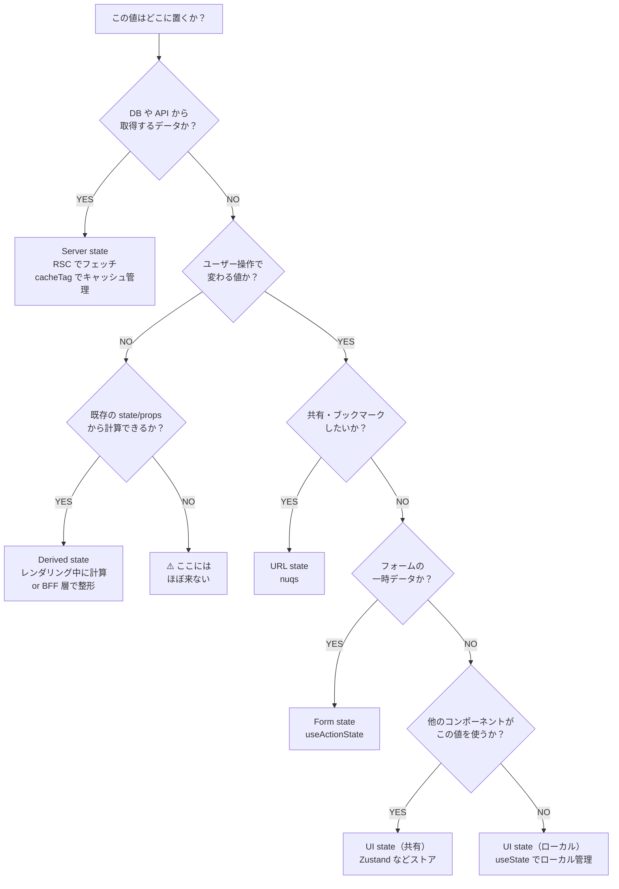
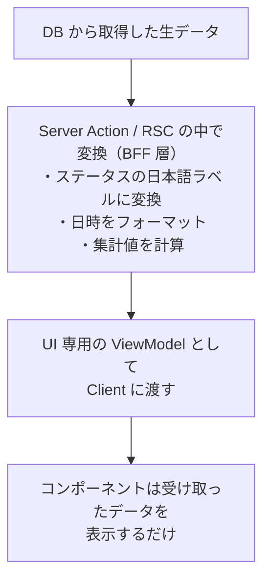
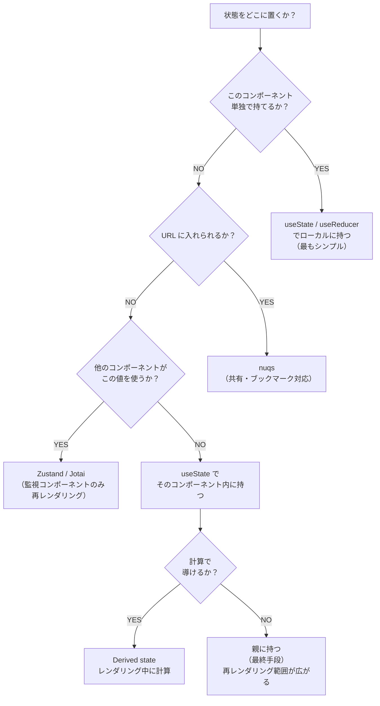
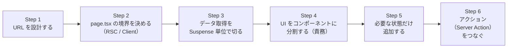
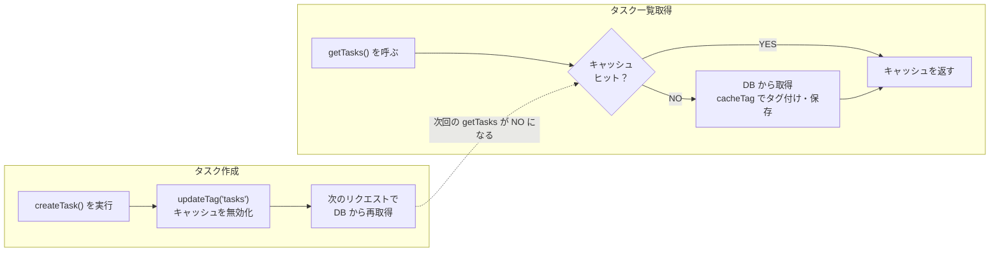

# 補足：ページ実装の設計思想（フロントエンド・アーキテクチャ）

この章は **読み物** です。実装タスクはありません。各章で実装を進めるうえで「なぜこう書くのか」「どこから書き始めるか」という設計の指針を理解したい方向けに、フロントエンド側のアーキテクチャを俯瞰します。

> NOTE
> バックエンド側（Server Actions・Repository・Service・Result 型）の設計については、別の補足ドキュメント「[Server Actions によるバックエンド設計と REST API との違い](./appendix-backend-architecture.md)」を参照してください。

---

## B-1. このドキュメントで扱う 3 つの軸

フロントエンドのページ実装で「どう書くか」を悩む場面は、大きく 3 つに分類できます。

```
┌─────────────────────────────────────────────────────────┐
│              フロントエンド設計の 3 つの軸               │
│                                                         │
│  1. 状態をどこに置くか                                   │
│     「この値は URL に入れるべきか、ストアか、親か」       │
│                                                         │
│  2. どこから書き始めるか                                 │
│     「何を先に決めれば、後から修正が少ないか」            │
│                                                         │
│  3. ロジックをどこに分離するか                           │
│     「page.tsx や コンポーネントに何を書かないべきか」    │
└─────────────────────────────────────────────────────────┘
```

これら 3 つを意識して設計することで、**変更に強く・読みやすく・テストしやすい**コードになります。以降の節でそれぞれを詳しく解説します。

---

## B-2. 状態の置き場所を選ぶ

コンポーネントが「何かを覚えておく必要がある」とき、その値をどこに置くかが設計の核心です。置き場所を間違えると、不要な再レンダリングが起きたり、状態が消えてしまったり、コードが読みにくくなります。

### B-2-1. 状態の 5 種類

まず、扱う「状態」には 5 種類あります。

| 種類 | 定義 | 例 |
|---|---|---|
| **Server state** | DB や外部 API から取得したデータ。サーバー側で持つ | タスク一覧、ユーザー情報、統計 |
| **URL state** | URL のクエリパラメータに乗る状態。共有・ブックマーク可能 | 検索ワード、フィルタ条件、ページ番号 |
| **Form state** | フォーム送信のために一時的に保持する状態 | 入力途中のテキスト、バリデーションエラー |
| **UI state** | 画面の見た目の制御。URL に出す必要がない一時的な状態 | モーダルの開閉、ドロップダウンの選択肢 |
| **Derived state** | 既存の状態や props から計算で導けるデータ | フィルタ済みのリスト、合計件数、選択中の件数 |

> NOTE
> **Derived state は「状態」ではありません。** 何かから計算できる値は、別途 state に持たず、レンダリング中にその場で計算します。これが「状態を最小限にする」の基本です。

---

### B-2-2. 判定フロー（どこに置くか）

「この値をどこに置くか」を決めるときは、以下のフローに沿って考えます。



**判定のコツ：** 上から順に YES か NO を辿るだけです。「YES の経路をできるだけ早く決断する」ことが設計の速度を上げます。

---

### B-2-3. 各種類の本プロジェクトでの実装手段

| 種類 | 本プロジェクトでの実装 | 章 |
|---|---|---|
| **Server state** | RSC の `async` 関数 + `"use cache"` / `cacheTag` | 第 07 章 |
| **URL state** | `nuqs` の `useQueryStates` / `searchParamsCache` | 第 08 章 |
| **Form state** | `useActionState` + Server Action | 第 05 章 |
| **UI state（共有）** | `zustand` の `useTaskStore` | 第 08 章 |
| **UI state（ローカル）** | `useState` でコンポーネント内に持つ | — |
| **Derived state** | レンダリング中に直接計算（`useState` を使わない）または BFF 層で整形 | — |

#### Server state の例

```tsx
// app/(authed)/tasks/components/TaskList/container.tsx
// "use cache" で結果がキャッシュされ、updateTag で無効化される
export async function TaskListContainer({ searchParams }) {
  const result = await getTasks(searchParams); // Server Action がキャッシュ制御
  if (isErr(result)) return <ErrorDisplay />;
  return <TaskListPresentation tasks={result.value} />;
}
```

#### URL state の例

```tsx
// app/(authed)/tasks/components/TaskFilters/index.tsx
'use client';

// URL の ?name=...&status=... と双方向同期する
const [{ name, status }, setSearchParams] = useQueryStates(
  searchParamsParsers,
  { shallow: false }, // URL 変更 → RSC が再実行されデータ再取得
);
```

URL に状態を置くことで、**リロードしてもフィルタが保持され**、**URL を共有すれば同じ状態が再現**できます。

#### UI state の例

```tsx
// app/(authed)/tasks/stores/task-store.ts（Zustand）
// 削除ダイアログの開閉だけを担う。タスクデータは持たない
export const useTaskStore = create<TaskStore>((set) => ({
  deleteDialogOpen: false,
  targetTaskId: null,
  openDeleteDialog: (id) => set({ deleteDialogOpen: true, targetTaskId: id }),
  closeDeleteDialog: () => set({ deleteDialogOpen: false, targetTaskId: null }),
}));
```

`useTaskStore` を監視するのは `DeleteTaskDialog` だけです。フィルタや一覧など **無関係なコンポーネントは再レンダリングされません**。

#### Derived state の例

```tsx
// ❌ やらない：state を増やして useEffect で同期する
const [filteredTasks, setFilteredTasks] = useState<Task[]>([]);
useEffect(() => {
  setFilteredTasks(tasks.filter(t => t.status === status));
}, [tasks, status]);

// ✅ やる：レンダリング中に計算する
const filteredTasks = tasks.filter(t => t.status === status);
```

`useEffect` を使うと「tasks が変わる → useEffect が走る → state が更新される → 再レンダリング」という 2 回のレンダリングが発生します。計算で済む値は **レンダリング中に 1 回で処理します**。

#### BFF 層での整形（サーバー側で表示用データを作る）

Derived state の別の解決策として、**BFF 層（Server Action や RSC）でサーバー側に変換ロジックを閉じ込める**方法があります。



```typescript
// app/(authed)/tasks/actions/tasks.ts

// UI 専用の型（DB の Task 型ではなく、表示に特化した型）
type TaskViewModel = {
  id: number;
  name: string;
  statusLabel: string;   // "in_progress" → "進行中"
  priorityLabel: string; // "high" → "高"
  formattedDate: string; // "2026-05-09"
  isOverdue: boolean;    // 期限切れかどうか（計算済み）
};

// BFF 層で変換してから返す
export async function getTasks(filters: TaskFilters): Promise<Result<TaskViewModel[]>> {
  const result = await taskService.getTasks(filters);
  if (isErr(result)) return result;

  return ok(result.value.map(toTaskViewModel));
}

function toTaskViewModel(task: Task): TaskViewModel {
  return {
    id: task.id,
    name: task.name,
    statusLabel: STATUS_LABELS[task.status],
    priorityLabel: PRIORITY_LABELS[task.priority],
    formattedDate: formatDate(task.createdAt),
    isOverdue: task.dueDate ? new Date(task.dueDate) < new Date() : false,
  };
}
```

この設計のメリット：

| メリット | 説明 |
|---|---|
| **コンポーネントが表示専用になる** | `task.statusLabel` を表示するだけ。変換ロジックを持たない |
| **ロジックがサーバーに閉じる** | ラベルマッピングや集計ルールがクライアントバンドルに入らない |
| **props の型が明確になる** | ViewModel 型が UI の要件を直接表現する |
| **単体テストが書きやすい** | `toTaskViewModel` は純粋関数なのでテストしやすい |

> TIP
> 「クライアントで計算できるが、サーバー側で整形した方がコードが綺麗になる」という場合は積極的に BFF 層で処理します。特に、**同じ変換を複数のコンポーネントで行っている**と気づいたら、Server Action に集約するサインです。

---

### B-2-4. 「親に持ち上げる」前に考える順序

複数のコンポーネントが同じ値を使う場合、**まず親にリフトアップすることを考えがちですが、それは最後の手段**です。

親に状態を持つと、**その値が変わるたびに親とすべての子コンポーネントが再レンダリング**されます。

**考える順序：**



> TIP
> **Zustand のメリットは「監視の限定」です。** `useTaskStore(state => state.deleteDialogOpen)` のように必要な slice だけを購読すると、他の値が変わっても再レンダリングが起きません。一方、親の `useState` は「親とその配下すべて」が再レンダリング対象になります。

---

### B-2-5. アンチパターン：useEffect で値を同期する

最も多い「不要な useEffect」のパターンを紹介します。

**パターン 1：props/state から派生する値を useEffect で同期している**

```tsx
// ❌
const [total, setTotal] = useState(0);
useEffect(() => {
  setTotal(tasks.reduce((acc, t) => acc + t.estimatedMinutes, 0));
}, [tasks]);

// ✅ レンダリング中に計算する
const total = tasks.reduce((acc, t) => acc + t.estimatedMinutes, 0);
```

**パターン 2：props の変化を useEffect で state に反映している**

```tsx
// ❌ props が変わるたびに 2 回レンダリングされる
const [localName, setLocalName] = useState(task.name);
useEffect(() => {
  setLocalName(task.name);
}, [task.name]);

// ✅ props をそのまま使う（または key で強制リセット）
// <EditForm key={task.id} task={task} />  ← key が変わると完全リセット
```

**パターン 3：マウント時のデータフェッチに useEffect を使っている**

```tsx
// ❌ Next.js App Router では不要
const [tasks, setTasks] = useState<Task[]>([]);
useEffect(() => {
  fetch('/api/tasks').then(r => r.json()).then(setTasks);
}, []);

// ✅ RSC（Server Component）でフェッチする
// app/(authed)/tasks/page.tsx を async にしてサーバー側でデータ取得
export default async function TasksPage() {
  const result = await getTasks();
  return <TaskListContainer tasks={result.value} />;
}
```

> NOTE
> useEffect が本当に必要な場面は「**外部システムとの同期**」だけです。具体的には、ブラウザの DOM API（スクロール位置の制御、フォーカス管理）、WebSocket などのサブスクリプション管理、サードパーティライブラリとの連携などです。「データを変換したい」「別の state に反映したい」という動機で useEffect を書く場合、ほぼ必ず不要です。

---

## B-3. ページを書き始める手順

「何からコードを書き始めるか」によって、後から修正が必要になる量が大きく変わります。以下の 6 ステップを意識すると、書き直しが最小になります。



---

### Step 1. URL を設計する

「どんな URL になるか」を最初に決めます。URL 設計はデータフローと状態管理の起点になるため、後から変えると影響範囲が大きくなります。

**決めること：**

- **ルート（pathname）**：`/tasks`、`/tasks/[id]/edit` など
- **URL state（クエリパラメータ）**：共有・ブックマークしたい状態
- **path params**：`:id` など、リソースを特定するもの

```
/tasks?name=会議&status=in_progress&page=2
 ↑             ↑                    ↑
 pathname       URL state            ページネーション
```

**チェックリスト：**
- [ ] この URL を誰かに送ったとき、同じ画面が再現されるか？
- [ ] ブラウザの「戻る」で前の状態に戻れるか？
- [ ] リロードしても状態が保持されるか？

---

### Step 2. page.tsx の境界を決める（RSC / Client）

`page.tsx` は **RSC（React Server Component）として、できるだけ薄く保ちます**。

```tsx
// app/(authed)/tasks/page.tsx の理想形
// ・async で searchParams を受け取る
// ・データ取得は child コンポーネントに委譲
// ・レイアウトと Suspense の配置だけを担う
export default async function TasksPage({ searchParams }) {
  return (
    <PageContainer>
      <PageHeader title="タスク一覧" />
      <TaskFilters />   {/* Client Component：URL 状態の読み書き */}
      <Suspense fallback={<TaskListSkeleton />}>
        <TaskListContainer searchParams={await searchParams} />
      </Suspense>
    </PageContainer>
  );
}
```

**RSC と Client Component の境界の原則：**

```
RSC（サーバー）                       Client（ブラウザ）
────────────────────────────────────  ────────────────────────────────
・データフェッチ                         ・イベントハンドラ（onClick 等）
・DB アクセス（Server Action 経由）       ・ブラウザ API（localStorage 等）
・機密情報の処理（APIキー等）             ・useState / useEffect
・大きな依存パッケージの除外              ・リアルタイム更新

→ できるだけここで処理を完結させる       → 必要なときだけ 'use client' をつける
```

> NOTE
> `'use client'` をつけるのは**木のできるだけ葉に近いコンポーネント**にします。上位のコンポーネントを Client にすると、その配下すべてが Client バンドルに含まれます。ただし、Client Component の `children` に RSC を渡すパターン（slot pattern）を使えば、上位が Client でも RSC を子に持てます。

```tsx
// ✅ Client Component の中に RSC を差し込むパターン
// layout.tsx や page.tsx などで children として渡す

// Shell は Client（インタラクション用）だが、children（RSC）はサーバーで実行される
function Shell({ children }: { children: React.ReactNode }) {
  'use client';
  const [open, setOpen] = useState(false);
  return (
    <div>
      <button onClick={() => setOpen(!open)}>切り替え</button>
      {open && children}  {/* ← ここに RSC が入る */}
    </div>
  );
}
```

**チェックリスト：**
- [ ] `'use client'` は最も葉に近い位置に付けているか？
- [ ] `page.tsx` にビジネスロジックや複雑な計算が入っていないか？
- [ ] データフェッチは RSC か Server Action で行っているか？

---

### Step 3. データ取得を Suspense 単位で切る

「ローディング状態をどう見せるか」はデータ取得の粒度と一致させます。

```tsx
// ❌ ページ全体が 1 つの Suspense：全部揃うまで何も表示されない
<Suspense fallback={<PageSkeleton />}>
  <DashboardStats />   {/* 重いクエリ */}
  <TaskList />         {/* 軽いクエリ */}
</Suspense>

// ✅ データ取得の単位ごとに Suspense を分割
<>
  <Suspense fallback={<StatsSkeleton />}>
    <DashboardStats />   {/* 重くても TaskList をブロックしない */}
  </Suspense>
  <Suspense fallback={<TaskListSkeleton />}>
    <TaskList />
  </Suspense>
</>
```

分割することで、**軽いコンポーネントは先に表示され**、**重いコンポーネントは非同期で後から追いつく**という段階的なレンダリングが実現します。

**loading.tsx との使い分け：**

| 方法 | 適用範囲 | 使いどころ |
|---|---|---|
| `loading.tsx` | ルート全体 | ページ遷移時のページ全体のローディング |
| `<Suspense>` | コンポーネント単位 | 1 ページ内で複数のデータ取得を並列化したいとき |

**チェックリスト：**
- [ ] 重いデータ取得が軽いコンポーネントの表示をブロックしていないか？
- [ ] ページ遷移時の `loading.tsx` は置いてあるか？

---

### Step 4. UI をコンポーネントに分割する（責務）

「どこで分割するか」の基準は**責務の違い**です。

**分割の 3 基準：**

```
1. 再利用性
   同じ UI が別の場所でも使われる場合 → 共有コンポーネントへ
   例: Button, Input, Badge は components/ui/ に

2. 責務の違い
   「データ取得」と「表示」は分離する（Container / Presentation パターン）
   例: TaskListContainer（取得）と TaskListPresentation（表示）

3. RSC / Client の境界
   インタラクションが必要な部分だけを Client Component に切り出す
   例: TaskFilters（クライアント）と TaskListContainer（サーバー）
```

**コロケーション（ファイルの置き場所）の原則：**

```
app/(authed)/tasks/
├── page.tsx                      ← tasks ページのエントリポイント
├── components/
│   ├── TaskList/
│   │   ├── container.tsx         ← データ取得（RSC）
│   │   └── presentation.tsx      ← 表示（props を受け取るだけ）
│   ├── TaskFilters/
│   │   └── index.tsx             ← URL state の読み書き（Client）
│   └── DeleteTaskDialog/
│       └── index.tsx             ← UI state の読み書き（Client）
├── actions/
│   └── tasks.ts                  ← Server Actions
└── lib/nuqs/
    └── searchParams.ts           ← URL state のパーサー定義
```

> TIP
> **共有されないコンポーネントは `app/(authed)/tasks/components/` の中に置きます**（コロケーション）。「いつか別のページでも使うかもしれない」という理由でいきなり `components/` のトップレベルに置くのは早すぎます。実際に共有が必要になったときに移動します。

**Container / Presentation パターンの利点：**

```tsx
// container.tsx：データ取得の責務
export async function TaskListContainer({ searchParams }) {
  const result = await getTasks(searchParams); // サーバー側でフェッチ
  if (isErr(result)) return <ErrorMessage error={result.error} />;
  return <TaskListPresentation tasks={result.value} />;
}

// presentation.tsx：表示の責務
// ・非同期処理なし
// ・テストしやすい（props を渡すだけで動作確認可能）
// ・Storybook でも使いやすい
export function TaskListPresentation({ tasks }: { tasks: Task[] }) {
  if (tasks.length === 0) return <EmptyState />;
  return (
    <ul>
      {tasks.map(task => <TaskItem key={task.id} task={task} />)}
    </ul>
  );
}
```

**チェックリスト：**
- [ ] コンポーネントの役割が 1 つか（「データ取得 and 表示」になっていないか）？
- [ ] 共有されないコンポーネントはそのページの `components/` に置いているか？
- [ ] 表示専用コンポーネントは props を受け取るだけになっているか？

---

### Step 5. 必要な状態だけ追加する

Step 1〜4 でレイアウトが固まったら、**B-2 の判定フロー**を使って必要な状態だけを追加します。

このタイミングで「これは URL state か、UI state か、Derived state か」を 1 つずつ確認します。ここで焦って `useState` を乱用すると、後から状態管理が複雑になります。

**状態を追加する前のチェック：**

```
この値、本当に state が必要ですか？

✅ YES が必要なケース
   - ユーザーの入力を追跡する（フォームの入力値）
   - ユーザー操作で変わる UI の状態（モーダルの開閉）
   - サーバーレスポンスを一時的に保持する

❌ state が不要なケース
   - props や他の state から計算できる値（Derived state）
   - サーバーから取得したデータ（RSC でフェッチ）
   - URL から読み書きできる値（URL state）
```

**チェックリスト：**
- [ ] 追加した state は「Derived state にできないか」を確認したか？
- [ ] B-2-4 の「考える順序」を辿ったか？

---

### Step 6. アクション（Server Action）をつなぐ

最後に、フォーム送信やボタンの操作を Server Action に接続します。Server Action の責務は**薄く保ちます**。

```tsx
// app/(authed)/tasks/actions/tasks.ts
'use server';

export async function createTask(
  prev: Result<Task> | null,
  formData: FormData,
): Promise<Result<Task>> {
  // ① FormData をオブジェクトに変換するだけ
  const data = Object.fromEntries(formData.entries());

  // ② ビジネスロジックは Service に委譲（Appendix A 参照）
  const result = await taskService.createTask(data);

  // ③ エラーを UI に返す（フォームのエラー表示に使う）
  if (isErr(result)) return result;

  // ④ キャッシュを無効化してリダイレクト
  updateTag(CACHE_TAGS.TASKS);
  redirect('/tasks');
}
```

> NOTE
> Server Action に**バリデーションやビジネスロジックを書かない**ようにします。「この値は有効か」「このユーザーはこの操作を許可されているか」という判断は Service 層の責務です。Server Action は「フォームとサーバーの橋渡し」に徹します。詳しくは [Appendix A](./appendix-backend-architecture.md) を参照してください。

**チェックリスト：**
- [ ] Server Action にバリデーションロジックが書かれていないか？
- [ ] `updateTag` で適切なキャッシュを無効化しているか？
- [ ] `useActionState` のエラー状態を UI で表示しているか？

---

## B-4. ロジックを hook に分離する

「コンポーネントが大きくなってきた」と感じたとき、ロジックを**カスタム hook** に分離します。目的は**表示とロジックを分けること**で、次のメリットが生まれます。

```
コンポーネント               カスタム hook
────────────────────────────  ──────────────────────────
・何を表示するか               ・どう動くか
・JSX の構造                  ・状態の管理
・見た目に関するコード          ・イベントの処理
                              ・外部との連携

→ 表示コードだけを見れば       → ロジックだけをテストできる
  UI がわかる
```

---

### B-4-1. 何を分離するか

**分離すべきロジックのシグナル：**

- コンポーネントが **50 行を超えてきた**
- 同じ処理を**別のコンポーネントでも使いたい**
- 処理の意図が JSX に埋もれて**読みにくい**

**よくある分離パターン：**

| パターン | hook 名の例 | 分離する内容 |
|---|---|---|
| フォーム制御 | `useTaskForm` | バリデーション、送信ロジック、エラーハンドリング |
| 検索・フィルタ | `useTaskFilters` | クエリパラメータの読み書き、リセット |
| リスト操作 | `useTaskList` | ソート、選択、ページネーション |
| 非同期処理 | `useAsyncOperation` | ローディング・エラー・成功状態の管理 |

---

### B-4-2. 表示とロジックを分けるとテストの輪が回る

```tsx
// ❌ 分離していない：ロジックと JSX が混在している
export function TaskFilters() {
  const [isPending, startTransition] = useTransition();
  const [{ name, status, priority }, setSearchParams] = useQueryStates(
    searchParamsParsers,
    { startTransition, shallow: false },
  );

  const handleReset = () => {
    setSearchParams({ name: "", status: "", priority: "" });
  };

  return (
    <div>
      <Input value={name} onChange={e => setSearchParams({ name: e.target.value })} />
      {/* ...残りの JSX... */}
      <Button onClick={handleReset}>リセット</Button>
    </div>
  );
}
```

```tsx
// ✅ 分離した：hook とコンポーネントが独立している
// hooks/useTaskFilters.ts
export function useTaskFilters() {
  const [isPending, startTransition] = useTransition();
  const [filters, setFilters] = useQueryStates(
    searchParamsParsers,
    { startTransition, shallow: false },
  );

  const reset = () => setFilters({ name: "", status: "", priority: "" });

  return { filters, setFilters, reset, isPending };
}

// components/TaskFilters/index.tsx
export function TaskFilters() {
  const { filters, setFilters, reset, isPending } = useTaskFilters();
  return (
    <div>
      <Input value={filters.name} onChange={e => setFilters({ name: e.target.value })} />
      <Button onClick={reset}>リセット</Button>
    </div>
  );
}
```

分離後は以下が独立して検証できるようになります：

- **`useTaskFilters` のテスト**：`@testing-library/react-hooks` で hook 単体テスト
- **`TaskFilters` の Storybook**：`useTaskFilters` をモックして UI のみ確認
- **`TaskFilters` のスナップショットテスト**：HTML の構造だけを検証

---

### B-4-3. カスタム hook の名前付けと責務範囲

**命名のルール：**

- `use` で始める（React の規約）
- **何をする hook か** がわかる名前にする（`useTaskFilters` → タスクのフィルタを管理する）
- 複数のコンポーネントをまたいで使う場合は `hooks/` に、1 コンポーネント専用なら `components/ComponentName/` の隣に置く

**責務の範囲：**

```
✅ hook に入れるもの
   - useState / useReducer の管理
   - useEffect（外部との同期が必要な場合のみ）
   - イベントハンドラのロジック
   - 派生値の計算（useMemo は通常不要。React Compiler が最適化する）

❌ hook に入れないもの
   - JSX（それはコンポーネントの責務）
   - Server Action の定義（それは actions/ に置く）
   - DB アクセス（それは Repository の責務）
```

---

### B-4-4. 本プロジェクトの実装例

本プロジェクトでは以下の箇所で hook の分離パターンが見られます。

**第 08 章：URL state の管理（nuqs）**

```
app/(authed)/tasks/lib/nuqs/searchParams.ts
  ↑ パーサー定義を hook ではなく定数として分離
  ↑ Server と Client の両方でインポートできる
```

```tsx
// Client 側での使い方（TaskFilters 内）
const [filters, setFilters] = useQueryStates(searchParamsParsers, { ... });

// Server 側での使い方（TaskListContainer 内）
const filters = searchParamsCache.parse(searchParams);
```

1 か所のパーサー定義で**型安全性を保ちながら Server / Client を共有**できています。これも一種の「ロジック分離」です。

**第 09 章：ダッシュボードの統計コンポーネント**

`DashboardStats` では、「統計データの取得」と「統計の表示（数字・ラベル・アイコン）」が Container / Presentation で分離されています。Presentation 側は純粋な表示コンポーネントになっているため、Storybook でモックデータを渡して確認できます。

---

## B-5. キャッシュ戦略

画面の「速さ」に直結するのがキャッシュです。本プロジェクトではサーバー側キャッシュを中心に使っていますが、用途によってはクライアント側キャッシュも検討します。

---

### B-5-1. サーバーキャッシュ（`"use cache"` + `cacheTag` / `updateTag`）

本プロジェクトのキャッシュ戦略は**第 07 章**で実装済みです。ここでは設計の意図を整理します。

```
"use cache" ディレクティブ
   └── 関数の戻り値を Next.js のサーバー側キャッシュに保持する
   └── 同じ引数で呼ばれると、DB にアクセスせずキャッシュから返す

cacheTag(CACHE_TAGS.TASKS)
   └── このキャッシュに "tasks" というタグをつける
   └── タグで無効化できる

updateTag(CACHE_TAGS.TASKS)
   └── "tasks" タグが付いたキャッシュをすべて無効化する
   └── 次のリクエストで DB から再フェッチされる
```



**キャッシュタグの管理場所：**

```typescript
// lib/cache/tags.ts
// タグ定数を 1 か所に集約し、タイポを防ぐ
export const CACHE_TAGS = {
  TASKS: 'tasks',
  DASHBOARD: 'dashboard',
} as const;
```

> NOTE
> `auth.api.getSession({ headers: await headers() })` を `"use cache"` や `unstable_cache` で包まないでください。`headers()` はリクエストスコープの値であり、キャッシュに入れるとセッション情報が別のユーザーに漏洩する危険があります。

---

### B-5-2. クライアントキャッシュ（TanStack Query）採用検討の指針

本プロジェクトでは **TanStack Query は未導入** です。しかし、プロダクト開発では採用を検討する場面があります。以下の基準で判断します。

**採用を検討するシグナル：**

| シグナル | 理由 |
|---|---|
| **リアルタイム更新が必要**（ポーリング、WebSocket） | サーバーキャッシュだけでは対応しにくい |
| **楽観的更新が複雑**（エラー時のロールバック） | `useOptimistic` より TQ の `onError` コールバックが扱いやすい |
| **無限スクロール**（`useInfiniteQuery`） | ページネーションのロジックを自前で書くより機能が豊富 |
| **クライアント側で API を叩く必要がある** | RSC / Server Actions が使えない状況（既存 REST API との連携など） |
| **同じデータを複数ページで共有したい** | TQ のキャッシュキーで自動的に共有・無効化できる |

**RSC + Server Actions との棲み分け：**

```
RSC + Server Actions + cacheTag（このプロジェクト）
  → データフェッチはサーバー側で完結
  → クライアントに状態が残らない
  → シンプルで型安全
  → ポーリング・楽観更新が複雑な場合は自前実装が必要

TanStack Query + REST API / Route Handlers
  → データフェッチはクライアント側
  → ポーリング・楽観更新・無限スクロールが得意
  → SSR との二重フェッチを避けるための工夫が必要
  → サーバーとクライアントで型を合わせる仕組みが別途必要（OpenAPI 等）
```

> TIP
> 「まず RSC + Server Actions で作り、TanStack Query が必要なインタラクションが出てきたら部分的に追加する」というアプローチが現実的です。最初から全面 TanStack Query にすると、RSC の恩恵（バンドルサイズ・サーバー側の機密処理）が失われます。

---

## B-6. アンチパターン集

よく陥りがちな設計ミスを短くまとめます。

---

### ❌ useEffect で派生値を同期する

→ **B-2-5** 参照。「計算できる値は state にしない」が基本です。

---

### ❌ 親に状態を持ち上げる前に代替案を検討しない

```tsx
// ❌ 親にリフトアップ → 不要な再レンダリングが広がる
function TasksPage() {
  const [deleteTarget, setDeleteTarget] = useState<number | null>(null);
  return (
    <>
      <TaskList onDeleteClick={setDeleteTarget} />
      <DeleteDialog taskId={deleteTarget} onClose={() => setDeleteTarget(null)} />
    </>
  );
}

// ✅ Zustand で独立したストアに持つ
// → TaskList と DeleteDialog だけが再レンダリング（TasksPage は再レンダリングされない）
function TasksPage() {
  return (
    <>
      <TaskList />          {/* ストアの openDeleteDialog を呼ぶだけ */}
      <DeleteDialog />      {/* ストアを購読して開閉 */}
    </>
  );
}
```

---

### ❌ page.tsx にロジックを書きすぎる

```tsx
// ❌ page.tsx がロジックの塊になっている
export default async function TasksPage({ searchParams }) {
  const params = await searchParams;
  const name = typeof params.name === 'string' ? params.name : '';
  const status = VALID_STATUSES.includes(params.status) ? params.status : '';
  const tasks = await db.select().from(tasksTable).where(...).limit(20);
  const stats = tasks.reduce(...);
  // ...100 行続く
}

// ✅ page.tsx は orchestration だけ
export default async function TasksPage({ searchParams }) {
  return (
    <PageContainer>
      <Suspense fallback={<StatsSkeleton />}>
        <DashboardStats />           {/* 統計取得はここに委譲 */}
      </Suspense>
      <TaskFilters />
      <Suspense fallback={<TaskListSkeleton />}>
        <TaskListContainer searchParams={await searchParams} />
      </Suspense>
    </PageContainer>
  );
}
```

---

### ❌ `'use client'` を高い位置に置く

```tsx
// ❌ layout.tsx に 'use client' をつける
// → レイアウト配下の全コンポーネントが Client バンドルに入る
'use client';
export default function AuthedLayout({ children }) { ... }

// ✅ インタラクションが必要なコンポーネントだけに 'use client' をつける
// AppHeader の中の ToggleThemeButton だけが Client Component
```

---

### ❌ hook を分けずに巨大コンポーネントを作る

コンポーネントが 80 行を超え、JSX とロジックが混在してきたら hook への分離を検討します。目安として：

- **状態変数が 3 つ以上ある** → 関連する state をまとめて hook に
- **useEffect が 2 つ以上ある** → それぞれの副作用を別 hook に
- **同じイベントハンドラが 2 か所以上に出てくる** → 共通 hook に

---

## B-7. チェックリスト

実装のフェーズごとに使えるチェックリストです。

### ページ実装前

- [ ] URL 設計をしたか（pathname・URL state・path params）
- [ ] ブックマークすべきフィルタ・状態は URL に入れているか
- [ ] `page.tsx` に書くことを「Suspense の配置とコンポーネントの接続」に限定したか

### 実装中

- [ ] 追加しようとしている `useState` は「Derived state にできないか」を確認したか
- [ ] B-2-4「親に持ち上げる前の考える順序」を辿ったか
- [ ] `useEffect` を書く前に「外部との同期か？」を確認したか
- [ ] コンポーネントが 50 行を超えたら hook への分離を検討したか
- [ ] `'use client'` をできるだけ葉に近いコンポーネントに付けているか
- [ ] データ取得は RSC か Server Action で行っているか（Client Component 内の `fetch` になっていないか）

### レビュー前

- [ ] `page.tsx` にビジネスロジックが書かれていないか
- [ ] Server Action が薄いか（バリデーション・ビジネスロジックを含んでいないか）
- [ ] コンポーネントのコロケーション（共有されないものは `tasks/components/` に置いているか）
- [ ] Suspense 境界は適切か（重いデータ取得が軽いコンポーネントをブロックしていないか）
- [ ] 不要な `useEffect` が残っていないか

---

## まとめ

このドキュメントで扱った設計の要点を最後にまとめます。

| テーマ | 要点 |
|---|---|
| **状態の置き場所** | Server → URL → Form → UI → Derived の順で判定。「Derived state は state にしない」 |
| **useEffect** | 外部との同期専用。派生値の同期・データフェッチ・props 反映には使わない |
| **コンポーネント責務** | Container（取得）と Presentation（表示）を分離。`page.tsx` は orchestration のみ |
| **'use client' の位置** | できるだけ葉に近いコンポーネントに。上位を Client にするとバンドルが太る |
| **hook 分離** | 50 行を超えたら検討。表示とロジックを分けるとテストと Storybook が使いやすくなる |
| **キャッシュ** | サーバーキャッシュ（`cacheTag`/`updateTag`）を基本に。TanStack Query はリアルタイム・楽観更新・無限スクロールが必要になってから |

---

## 次に読む

**状態管理と URL state の実装**を確認したい方はこちら：

→ [第 08 章：nuqs + Zustand](./08-nuqs-zustand.md)

**サーバーキャッシュの実装**を確認したい方はこちら：

→ [第 07 章：Cache Components](./07-cache-components.md)

**コンポーネント分割の実装例**を見たい方はこちら：

→ [第 09 章：仕上げ - Dashboard + デプロイ準備](./09-finishing.md)

**useMemo を書かない設計の理由**を詳しく知りたい方はこちら：

→ [第 14 章：React Compiler + Turbopack](./14-react-compiler.md)

**バックエンド側の設計**（Server Action・Repository・Service）を理解したい方はこちら：

→ [Appendix A：Server Actions によるバックエンド設計と REST API との違い](./appendix-backend-architecture.md)
